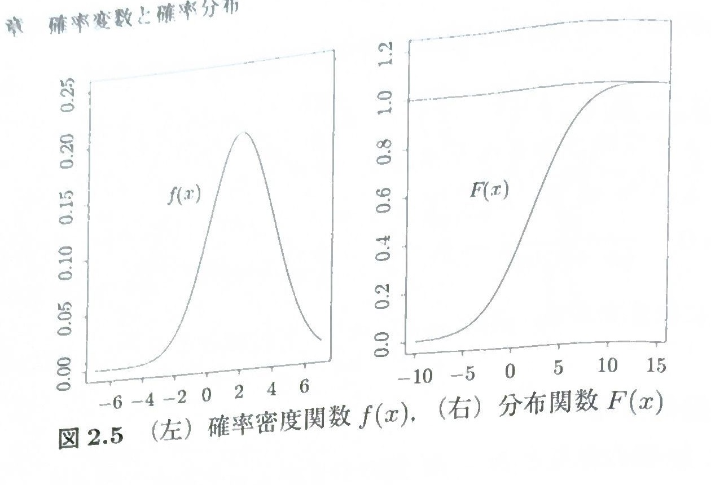
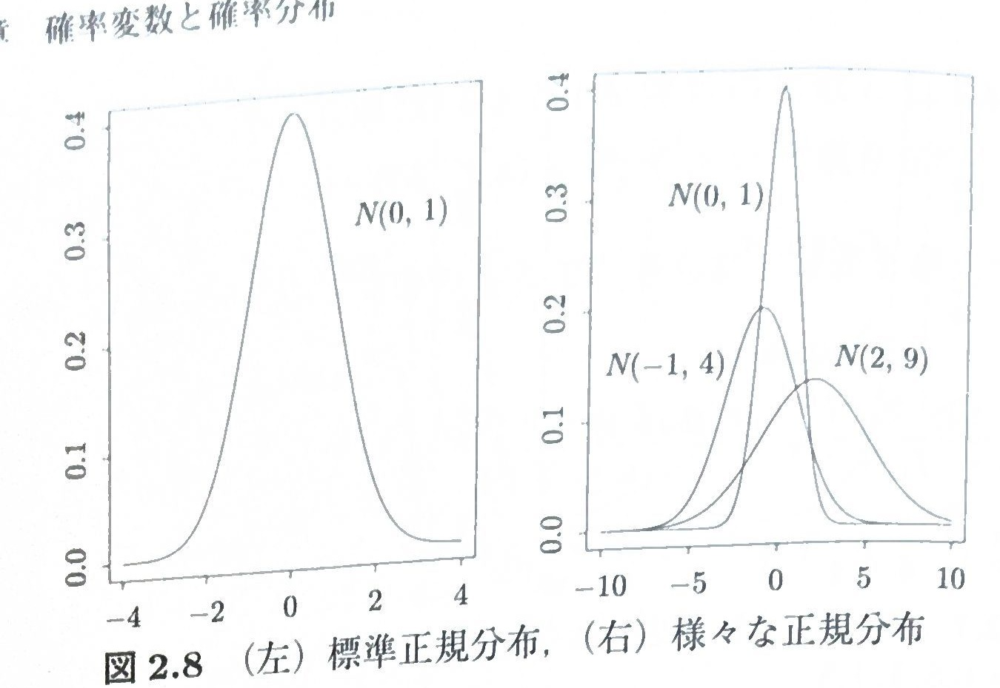

[[確率分布の関係性の目次]]

> [!note] この追記部分の資料の扱い
> 数学的な定義・確率関数・平均・分散は元PDFの記述と、NIST・Encyclopedia of Mathematics・SciPy などの標準資料で照合している。
> 「歴史的経緯」は人物名や年代を並べるのではなく、**それまでの確率モデルでは何が答えられず、どんな問いを扱うために次の分布が必要になるのか**という発展の流れを中心に説明する。
> ここでいう「歴史」は厳密な発明史ではなく、確率分布どうしの理論的な発展関係を学ぶための説明である。実際の発明順序を根拠なく推測することはしない。
> 各分布では、まず「1からこの分布を数式で構成する」で数学的導出を完結させる。その次の「歴史的経緯」では導出を繰り返さず、その分布が必要になった問題意識・既存モデルでは不足した点・後に重要になった理由だけを補う。その後に「前述分布との関係 → 使用条件 → 総和が1 → 平均 → 分散 → 重要な性質」の証明へ進む。

ここからは難しい話は

にまとめていくが、難しすぎるので勉強会では触れません。あくまで自分の備忘録として追加しているので、読んでもわからないと思う

# 確率変数

標本から必要な情報を取り出す対応を確率変数という。（[より詳しい条件](可測関数.md)）
今僕たちが計算したい対象は「サイコロを投げたら1が出た」という現象か？
違う、「サイコロを投げたら"1"が出る」という１という値が欲しい。この考え方が確率変数である。

こうなっていいことって何やねん。A,確率変数によって意味のある数字として標本を表現できる。
ちょっと数式的な描き方すると確率変数Xは
$$
\forall \omega\in\Omega,X(\omega)\in \mathbb{R}
$$
であるが、$\omega$何かは省略されてXで描画される。

確率変数によって標本という概念的なものから扱いやすい数値として定義できた。こっからは事象につなげていくことで確率変数を使用して確率を扱っていく

確率変数で確率を表すときのルールとして
$$P(X=x_i):=P(\{\omega \in \Omega|X(\omega)=x_i\})$$
こうなった場合$P(X=x_i)$は集合を扱う測度ではなく数値を入力に持つ関数として扱えるので$p(x_i)=P(X=x_i)$は確率関数と呼ぶことになる。

確率変数は$\{X(\omega)|\omega \in \Omega\}$と表した時の集合が有限もしくは可算無限のとき離散確率変数といい、非可算無限の場合は連続確率変数という

# 分布関数

分布関数とは、確率変数が$a\in R$以下になる確率値を出力する関数F
$$
F(a)=P(X\le a)
$$
>[!Tips] 分布関数とかいらんでしょ
>実は理論としては重要、どのような分布でも必ず存在するから。
>確率変数Xから誘導される確率測度(像測度)は以下のように定義できる量$\mu$である
>ボレル集合族$\mathcal{B}_ｄ$の集合$B\in \mathcal{B}_d$について
>$$\mu(B)=P(X\in B)=P(X^{-1})=P(\{\omega \in \Omega |X(\omega)\in B\})$$
>このような確率測度はどのような確率空間でも定義できる
>（実はカントール分布という、連続でも離散でもない分布が登場し、その場合この像測度は定義できるが確率関数も密度も定義できないというようなものの解析に必要になる。）
>いま、確率変数を用いて操作している理由の一つが関数として確率を扱いたいから、この像測度を関数として扱えるようにしたのが分布関数である。
>$$F(x)=\mu([-\infty,x])$$

# 期待値と分散

>[!Definition] 定義2.1　離散確率変数の期待値
>$\sum_i^\infty |x_i|p(x_i)<\infty$のとき期待値を$E[X]=\sum_i^\infty x_ip(x_i)$とあらわす。任意の関数ｇについて期待値を取る際は、$\sum_i^\infty |g(x_i)|p(x_i)<\infty$のとき$E[g(X)]=\sum_i^\infty g(x_i)p(x_i)$とあらわす。

>[!tips] $\sum_i^\infty |x_i|p(x_i)<\infty$（可積分性）がなんで必要なん？
>実はこれは「期待値を有限な数値として扱うための」かなりきつい条件である。（このように設定してしまうと無限は期待値として設定してはいけない）
>無限を扱いたい場合(例えば極限で)確率論では、$X^+$(Xが正の値はそのまま取り出し、負は全部０) or $X^-$(負の値は正として取り出し、あとは０)が期待値で有限であれば良いとされることがある。（期待値を計算するうえで互いを相殺し合う２つの内どちらかが有限であれば良い）
>$X=X^+-X^-$という関係性から
>$$E[X]=E[X^+]-E[X^-]$$
>どちらかが無限で残り有限なら期待値$\infty$として扱える。（こうすることで期待値の発散方向などの議論が行える）
>しかし、$X^+,X^-$の両方が$\infty$の場合、$E[X]=\infty-\infty$になり、相殺のさせかた次第で$-\infty,\infty,0$にでもなってしまうため期待値を定義できない。
>この最も有名な分布がコーシー分布である。コーシー分布とは正規分布のように対称的な釣鐘状の分布であるが$X=\infty$まで確率が存在する裾の長い分布である。そのため負でも正でも無限になるので、期待値を定義できないので中央値や別の値で代用せなあかんくなる。

>[!Definition] 定義2.2 　分散
>期待値が定義できるとき、$\mu$または確率変数を明示して$\mu_X$で表す。分散$\sigma^2,\sigma^2_X,var(X)$は
>$$E[(X-\mu)^2]=\sum_i^\infty (x_i-\mu)^2p(x_i)$$
>この値の平方根は標準偏差という

（どうせ標準偏差で平方根取るなら2乗じゃなく絶対値使えばいいのに、、、絶対値は良くない。絶対値は微分できないし扱いづらい関数であるから)

分散の計算方法で有名なものがいくつかあるので紹介
1. $Var(X)=E[X^2]-(E[X])^2$:これは$E[(X-\mu)^2]=E[X^2-2X\mu;\mu^2]=E[X^2]-2E[X]\mu+\mu^2=E[X^2]-2\mu^2+\mu^2$より
2. $E[X(X-1)]=E[X^2]-E[X]$、これに$E[X]^2-E[X]$を引けば導出可能。平均は出せることが多くかつ組み合わせで表現できる分布に反してはX!などを含みやすく$E[X(X-1)]$という形を自然に作りやすいのでよく使用される

# ベルヌーイ分布

ある事象Aについてそれが起きるか起こらないかを表現する分布である。確率変数は0,1の2値の値しか取らないものとして、Aが起きる場合X=1,起きない場合はX=0とする。しっかり書くなら
$$
X(\omega)=1_{\omega \in A}
$$
p(X=1)=pとかけるときベルヌーイ分布は
$$
p(X=x)=p(x)=p^x(1-p)^{1-x}
$$
またベルヌーイ分布で表現できるような、ある施行に対してAが起きたか起きないかを観測する施行をベルヌーイ試行という。

## 1からこの分布を作る：事象を0/1へ変換する

ベルヌーイ分布は「公式を暗記する」より、**1つの事象を指示変数に変換する**ところから作ると理解しやすい。

確率空間 $(\Omega,\mathcal F,P)$ と事象 $A\in\mathcal F$ を考え、

$$
p:=P(A)
$$

とおく。補集合 $A^c$ について、$A\cap A^c=\varnothing$ かつ $A\cup A^c=\Omega$ なので、確率の加法性から

$$
\begin{aligned}
1
&=P(\Omega)\\
&=P(A\cup A^c)\\
&=P(A)+P(A^c)\\
&=p+P(A^c)
\end{aligned}
$$

である。したがって、

$$
\begin{aligned}
P(A^c)
&=1-p
\end{aligned}
$$

となる。

ここで、事象 $A$ が起きたかどうかだけを取り出す確率変数

$$
X(\omega):=
\begin{cases}
1 & (\omega\in A)\\
0 & (\omega\notin A)
\end{cases}
$$

を定義する。これは指示変数 $X=1_A$ である。

すると、

$$
\begin{aligned}
P(X=1)
&=P(\{\omega\in\Omega\mid X(\omega)=1\})\\
&=P(A)\\
&=p
\end{aligned}
$$

であり、

$$
\begin{aligned}
P(X=0)
&=P(\{\omega\in\Omega\mid X(\omega)=0\})\\
&=P(A^c)\\
&=1-p
\end{aligned}
$$

となる。

$X$ が取りうる値は $0,1$ だけなので、この2式を1本にまとめると

$$
P(X=x)=p^x(1-p)^{1-x},\qquad x\in\{0,1\}
$$

となる。実際、

$$
\begin{aligned}
x=1:\quad p^1(1-p)^0&=p,\\
x=0:\quad p^0(1-p)^1&=1-p
\end{aligned}
$$

である。

## 歴史的経緯：1を補う「なぜ必要になったか」

ベルヌーイ分布そのものの式は前節で作ったので、ここでは**なぜ「1回の二値試行」を独立したモデルとして切り出す必要があったのか**だけを見る。

確率論の初期には、賭けや偶然に左右される判断を「どちらがどれくらい起こりやすいか」と数量化する問題が中心にあった。しかし、単に1回の勝敗の確率を計算するだけでは、現実の観測から未知の確率について考えることはできない。そこで重要になったのが、**同じ条件の試行を繰り返し、1回1回の成否を共通の単位として扱う**という考え方である。

この「1回分」を切り出しておけば、その後に

- 成功回数を数える
- 成功割合を見る
- 成功するまで待つ

といった別の問題へ同じ部品を使い回せる。実際、Bernoulli の反復試行の研究では、未知の成功確率と多数回の試行で観測される成功割合との関係が問題になり、後の大数の法則につながった。

したがってベルヌーイ分布の重要性は、単に「0と1を取る簡単な分布」であることではなく、**反復試行を数学的に組み立てるための最小単位を与えたこと**にある。

> [!source] 歴史的背景の根拠
> - MacTutor History of Mathematics, “Jacob Bernoulli”: https://mathshistory.st-andrews.ac.uk/Biographies/Bernoulli_Jacob/
> - MacTutor, Bernoulli と大数の法則に関する解説: https://mathshistory.st-andrews.ac.uk/Extras/Talagrand_awards/
## 前述の内容との関係

ここまでに導入した「事象を確率変数で数値化する」という操作の最も単純な例がベルヌーイ分布である。

$$
A
\longrightarrow
1_A
\longrightarrow
\{0,1\}\text{上の確率分布}
$$

という流れになっている。

また、この1個のベルヌーイ確率変数が以降の分布の基本部品になる。独立なベルヌーイ変数を固定回数だけ足せば2項分布になり、最初の成功まで待てば幾何分布になる。

## 現場ではいつ使えるか

1回の観測結果が本質的に2択であり、そのどちらかを $1/0$ で符号化できるときに使う。例えば「検査に合格したか」「部品が不良だったか」「広告がクリックされたか」のような**1回の二値観測**である。

重要なのは、ベルヌーイ分布は1回分の試行を表すという点である。同じ条件の試行を $n$ 回行い、その成功回数を知りたいなら2項分布へ進む。

> [!source] 根拠資料
> - Encyclopedia of Mathematics, “Bernoulli theorem”: https://encyclopediaofmath.org/wiki/Bernoulli_theorem
> - Encyclopedia of Mathematics, “Bernoulli trials”: https://encyclopediaofmath.org/wiki/Bernoulli_scheme
> - OpenStax, “Binomial Distribution”: https://openstax.org/books/introductory-statistics-2e/pages/4-3-binomial-distribution

分布に重要な値として、まず「本当に確率分布になっているか」、つまり確率の総和が1になることを確認しておく。以降の分布でも同じ順番で確認する。

## 確率の総和が1になること

ベルヌーイ分布では $X$ が取りうる値は $0,1$ だけなので、

$$
\begin{aligned}
\sum_{x\in\{0,1\}}p(x)
&=p(0)+p(1)\\
&=p^0(1-p)^{1-0}+p^1(1-p)^{1-1}\\
&=(1-p)+p\\
&=1
\end{aligned}
$$

となる。したがって、ベルヌーイ分布の確率関数は確率の総和が1になる。

## 平均

期待値の定義から、取りうる値をすべて足せばよい。

$$
\begin{aligned}
E[X]
&=\sum_{x\in\{0,1\}}xp(x)\\
&=0\cdot p(0)+1\cdot p(1)\\
&=0\cdot(1-p)+1\cdot p\\
&=p
\end{aligned}
$$

したがって、

$$
E[X]=p
$$

である。

## 分散

まず $E[X^2]$ を計算する。

$$
\begin{aligned}
E[X^2]
&=\sum_{x\in\{0,1\}}x^2p(x)\\
&=0^2(1-p)+1^2p\\
&=p
\end{aligned}
$$

よって、分散の公式 $Var(X)=E[X^2]-(E[X])^2$ を使うと、

$$
\begin{aligned}
Var(X)
&=E[X^2]-(E[X])^2\\
&=p-p^2\\
&=p(1-p)
\end{aligned}
$$

となる。

ここから先では式を短くするために

$$
q:=1-p
$$

と書くことがある。

---

# 2項分布

ベルヌーイ試行を独立に $n$ 回繰り返し、そのうち「成功」した回数を確率変数 $X$ とする。このとき $X$ は

$$
X\in\{0,1,2,\ldots,n\}
$$

の値を取り、この分布を2項分布という。

$$
X\sim Bin(n,p)
$$

と書く。

## 1からこの分布を作る：ベルヌーイ分布を固定回数だけ足す

$i$ 回目のベルヌーイ試行を

$$
X_i=
\begin{cases}
1 & (i\text{回目が成功})\\
0 & (i\text{回目が失敗})
\end{cases}
$$

とし、

$$
P(X_i=1)=p,\qquad P(X_i=0)=q:=1-p
$$

とする。さらに $X_1,\ldots,X_n$ は独立であると仮定する。

成功回数は

$$
X:=X_1+X_2+\cdots+X_n
$$

である。$X=k$ とは、$n$ 個の $X_i$ のうちちょうど $k$ 個が1で、残り $n-k$ 個が0になることである。

成功する位置を1通り固定すると、独立性からその並びの確率は

$$
\begin{aligned}
&p\times\cdots\times p\times q\times\cdots\times q\\
&=p^kq^{n-k}
\end{aligned}
$$

となる。

一方、$n$ 箇所から成功する $k$ 箇所を選ぶ方法は

$$
\binom nk
$$

通りある。それぞれ異なる成功位置を表す事象は互いに排反なので、確率を足し合わせると

$$
\begin{aligned}
P(X=k)
&=\underbrace{p^kq^{n-k}+\cdots+p^kq^{n-k}}_{\binom nk\text{個}}\\
&=\binom nkp^kq^{n-k}
\end{aligned}
$$

となる。これが2項分布の確率関数である。

## 歴史的経緯：1を補う「なぜ必要になったか」

前節ではベルヌーイ試行を $n$ 回並べれば2項分布の式が出ることを示した。ここで重要なのは、**なぜ「並び方」ではなく「成功した個数」だけを取り出す分布が必要だったのか**である。

確率論の初期にはゲームの勝敗やくじのような反復試行が主要な問題だったが、試行を何度も行うようになると、「この並びが起きる確率」よりも、**一定回数の中で目的の事象が何回起きるか**の方が重要になる。さらに、観測された成功割合から元の成功確率について考えるには、成功回数全体のばらつきを扱う必要がある。

このため2項分布は、単発の確率計算と「多数回観測したときの頻度」の間をつなぐ役割を持つようになった。Bernoulli の反復試行の研究でも、試行回数が増えたとき成功割合が真の確率へ近づくことが主要な問題となっており、2項型の成功回数モデルはその土台になっている。

つまり、2項分布が必要になった背景は、**1回の成否を知るだけではなく、反復した結果から頻度や確率について議論したい**という要求にある。前節の数式的構成は、この問題意識を正確な確率分布にしたものと考えればよい。

> [!source] 歴史的背景の根拠
> - MacTutor, Jacob Bernoulli の反復試行と大数の法則の解説: https://mathshistory.st-andrews.ac.uk/Extras/Talagrand_awards/
> - MacTutor, Jacob Bernoulli / *Ars Conjectandi*: https://mathshistory.st-andrews.ac.uk/Strick/Bernoulli_Jacob.pdf
## 前述の分布との関係

ベルヌーイ分布との関係は

$$
X_i\sim Bernoulli(p)
$$

を独立に $n$ 個用意し、

$$
X=\sum_{i=1}^{n}X_i
$$

と置くことに尽きる。このとき

$$
X\sim Bin(n,p)
$$

となる。

特に $n=1$ なら

$$
Bin(1,p)=Bernoulli(p)
$$

なので、ベルヌーイ分布は2項分布の特殊例でもある。

## 現場ではいつ使えるか

2項分布を使うには、少なくとも次のモデル化が妥当である必要がある。

- 試行回数 $n$ があらかじめ固定されている。
- 各試行は成功・失敗の2値で表せる。
- 各試行の成功確率が同じ $p$ である。
- 試行同士を独立とみなせる。

例えば、一定条件で作られた製品を独立に $n$ 個検査し、不良品数を数える状況は典型例である。NIST でも不適合品数のモデルとして2項分布を用い、品質管理の $p$ 管理図につなげている。

逆に、有限個の集団から**非復元抽出**すると試行は独立でなくなるため、原則として後述する超幾何分布が対応する。

> [!source] 根拠資料
> - NIST/SEMATECH e-Handbook, “Binomial Distribution”: https://itl.nist.gov/div898/handbook/eda/section3/eda366i.htm
> - NIST/SEMATECH e-Handbook, “Proportions Control Charts”: https://itl.nist.gov/div898/handbook/pmc/section3/pmc332.htm
> - Encyclopedia of Mathematics, “Bernoulli trials”: https://encyclopediaofmath.org/wiki/Bernoulli_scheme
> - Encyclopedia of Mathematics, “Binomial distribution”: https://encyclopediaofmath.org/wiki/Binomial_distribution

## 確率関数の導出をもう一度、組合せから確認する

$n$ 回の試行のうち、成功がちょうど $k$ 回、失敗が $n-k$ 回起きたとする。

まず、成功・失敗の並び方を1つ固定する。例えば

$$
\underbrace{\circ\ \circ\ \times\ \circ\ \times\ \cdots}_{n\text{回}}
$$

のように成功する場所が完全に決まっているとする。各試行は独立なので、この1つの並びが起きる確率は

$$
p^kq^{n-k}
$$

である。

一方、$n$ 個の場所から成功する $k$ 個の場所を選ぶ方法は

$$
\binom{n}{k}=\frac{n!}{k!(n-k)!}
$$

通りある。したがって、成功回数がちょうど $k$ 回になる確率は

$$
P(X=k)=\binom{n}{k}p^kq^{n-k},\qquad k=0,1,\ldots,n
$$

となる。

## 確率の総和が1になること

確率関数をすべて足すと、

$$
\begin{aligned}
\sum_{k=0}^{n}P(X=k)
&=\sum_{k=0}^{n}\binom{n}{k}p^kq^{n-k}\\
&=(p+q)^n
\end{aligned}
$$

となる。最後の等号は2項定理そのものである。

ここで $q=1-p$ なので、

$$
\begin{aligned}
(p+q)^n
&=(p+1-p)^n\\
&=1^n\\
&=1
\end{aligned}
$$

したがって、

$$
\sum_{k=0}^{n}P(X=k)=1
$$

が確かめられた。

## 平均

期待値の定義から、

$$
E[X]=\sum_{k=0}^{n}k\binom{n}{k}p^kq^{n-k}
$$

である。$k=0$ の項は $0$ なので、

$$
E[X]=\sum_{k=1}^{n}k\binom{n}{k}p^kq^{n-k}
$$

と書ける。

ここで、係数の部分を変形する。

$$
\begin{aligned}
k\binom{n}{k}
&=k\frac{n!}{k!(n-k)!}\\
&=\frac{k\,n!}{k(k-1)!(n-k)!}\\
&=\frac{n!}{(k-1)!(n-k)!}\\
&=n\frac{(n-1)!}{(k-1)!(n-k)!}\\
&=n\binom{n-1}{k-1}
\end{aligned}
$$

したがって、

$$
\begin{aligned}
E[X]
&=\sum_{k=1}^{n}n\binom{n-1}{k-1}p^kq^{n-k}\\
&=np\sum_{k=1}^{n}\binom{n-1}{k-1}p^{k-1}q^{n-k}
\end{aligned}
$$

となる。

ここで

$$
j=k-1
$$

とおく。$k=1$ のとき $j=0$、$k=n$ のとき $j=n-1$ であり、さらに

$$
n-k=n-(j+1)=n-1-j
$$

なので、

$$
\begin{aligned}
E[X]
&=np\sum_{j=0}^{n-1}\binom{n-1}{j}p^jq^{n-1-j}\\
&=np(p+q)^{n-1}\\
&=np\cdot1^{n-1}\\
&=np
\end{aligned}
$$

となる。

したがって、2項分布の平均は

$$
E[X]=np
$$

である。

## 分散

2項分布では $E[X^2]$ を直接計算するより、まず

$$
E[X(X-1)]
$$

を計算した方が式がきれいになる。

期待値の定義から、

$$
E[X(X-1)]
=\sum_{k=0}^{n}k(k-1)\binom{n}{k}p^kq^{n-k}
$$

である。$k=0,1$ の項は $0$ なので、

$$
E[X(X-1)]
=\sum_{k=2}^{n}k(k-1)\binom{n}{k}p^kq^{n-k}
$$

となる。

係数を丁寧に変形すると、

$$
\begin{aligned}
k(k-1)\binom{n}{k}
&=k(k-1)\frac{n!}{k!(n-k)!}\\
&=k(k-1)\frac{n!}{k(k-1)(k-2)!(n-k)!}\\
&=\frac{n!}{(k-2)!(n-k)!}\\
&=n(n-1)\frac{(n-2)!}{(k-2)!(n-k)!}\\
&=n(n-1)\binom{n-2}{k-2}
\end{aligned}
$$

となる。これを代入すると、

$$
\begin{aligned}
E[X(X-1)]
&=\sum_{k=2}^{n}n(n-1)\binom{n-2}{k-2}p^kq^{n-k}\\
&=n(n-1)p^2\sum_{k=2}^{n}\binom{n-2}{k-2}p^{k-2}q^{n-k}
\end{aligned}
$$

である。

ここで

$$
j=k-2
$$

とおく。$k=2$ のとき $j=0$、$k=n$ のとき $j=n-2$ であり、

$$
n-k=n-(j+2)=n-2-j
$$

なので、

$$
\begin{aligned}
E[X(X-1)]
&=n(n-1)p^2\sum_{j=0}^{n-2}\binom{n-2}{j}p^jq^{n-2-j}\\
&=n(n-1)p^2(p+q)^{n-2}\\
&=n(n-1)p^2
\end{aligned}
$$

となる。

また、

$$
X^2=X(X-1)+X
$$

なので、期待値を取れば

$$
\begin{aligned}
E[X^2]
&=E[X(X-1)]+E[X]\\
&=n(n-1)p^2+np
\end{aligned}
$$

となる。

したがって、

$$
\begin{aligned}
Var(X)
&=E[X^2]-(E[X])^2\\
&=n(n-1)p^2+np-(np)^2\\
&=(n^2-n)p^2+np-n^2p^2\\
&=n^2p^2-np^2+np-n^2p^2\\
&=np-np^2\\
&=np(1-p)\\
&=npq
\end{aligned}
$$

となる。

したがって、2項分布では

$$
E[X]=np,\qquad Var(X)=np(1-p)
$$

である。

---

# 幾何分布

## 1からこの分布を作る：最初の成功まで待つ

独立同分布なベルヌーイ確率変数

$$
B_1,B_2,B_3,\ldots
$$

を考え、

$$
P(B_i=1)=p,\qquad P(B_i=0)=q:=1-p
$$

とする。このノートでは「最初の成功が起こる前の失敗回数」を数えるので、

$$
X:=\min\{j\mid B_j=1\}-1
$$

と定義する。

$X=k$ であるための必要十分条件は

$$
B_1=0,\ B_2=0,\ \ldots,\ B_k=0,\ B_{k+1}=1
$$

である。したがって、

$$
\begin{aligned}
P(X=k)
&=P(B_1=0,\ldots,B_k=0,B_{k+1}=1)\\
&=P(B_1=0)\cdots P(B_k=0)P(B_{k+1}=1)\\
&=\underbrace{q\times\cdots\times q}_{k\text{個}}\times p\\
&=q^kp
\end{aligned}
$$

となる。2行目で使ったのが各試行の独立性である。

## 歴史的経緯：1を補う「なぜ必要になったか」

前節では「最初の成功までの失敗回数」を数えると幾何分布が得られることを示した。歴史的な背景として重要なのは、**確率論の問題が必ずしも「最初に試行回数を決める問題」だけではなかった**ことである。

ゲームや反復試行では、「あと何回行えば目的の結果が初めて出るのか」「目的の結果が出るまで続けると、どれくらい待つのか」という**停止条件を持つ問題**も自然に現れる。この種の問題では、試行回数を先に固定する2項分布だけでは問いの形に直接対応できない。

幾何分布に相当する考え方は確率論のかなり初期から現れており、MacTutor が紹介する数学用語史では、1654年の Fermat と Pascal の議論の一部を幾何分布に基づく議論とみなす数学史研究が紹介されている。一方で “geometric distribution” という現在の名称自体はずっと後に定着した。

したがってこの分布は、**固定された回数の中の成功数だけでなく、「最初に成功するまで」というランダムな待ち時間も確率論の対象にする必要があった**という流れの中で理解するとよい。

> [!source] 歴史的背景の根拠
> - MacTutor, “Earliest Known Uses ... (G)”: https://mathshistory.st-andrews.ac.uk/Miller/mathword/g/
> - Encyclopedia of Mathematics, “Geometric distribution”: https://encyclopediaofmath.org/wiki/Geometric_distribution
## 前述の分布との関係

ベルヌーイ分布が「1回の成否」を表したのに対し、幾何分布はベルヌーイ試行を

$$
失敗,\ldots,失敗,成功
$$

となるまで反復したときの**停止までの待ち時間**を表す。

同じベルヌーイ試行からでも、

$$
\text{固定回数の成功数}\longrightarrow Bin(n,p)
$$

を作るのか、

$$
\text{最初の成功までの失敗数}\longrightarrow Geo(p)
$$

を作るのかで分布が変わる。

## 現場ではいつ使えるか

「成功するまで同じ試行を繰り返す」状況で、各試行の成功確率 $p$ が変わらず、試行を独立とみなせるときに使える。例えば通信の再送を成功するまで繰り返す回数、一定条件の探索で最初に目的物が見つかるまでの失敗回数などを、この仮定の下でモデル化できる。

ただし成功確率が試行ごとに変化する場合や、過去の失敗が次の成功確率を変える場合には幾何分布の仮定は崩れる。

> [!source] 根拠資料
> - Encyclopedia of Mathematics, “Geometric distribution”: https://encyclopediaofmath.org/wiki/Geometric_distribution
> - SciPy, `scipy.stats.geom`: https://docs.scipy.org/doc/scipy/reference/generated/scipy.stats.geom.html
> - OpenStax, “Geometric Distribution”: https://openstax.org/books/statistics/pages/4-4-geometric-distribution-optional

## 確率の総和が1になること

$0<p\le1$ とする。このとき $0\le q<1$ なので、無限等比級数（幾何級数）が収束する。

$$
\begin{aligned}
\sum_{k=0}^{\infty}P(X=k)
&=\sum_{k=0}^{\infty}pq^k\\
&=p\sum_{k=0}^{\infty}q^k\\
&=p\frac{1}{1-q}\\
&=p\frac{1}{1-(1-p)}\\
&=p\frac{1}{p}\\
&=1
\end{aligned}
$$

したがって、幾何分布の確率の総和は1になる。

## 平均

まず、期待値の定義にそのまま幾何分布の確率関数を代入して、**これから何を計算しなければならないのか**を確認する。

$$
\begin{aligned}
E[X]
&=\sum_{k=0}^{\infty}kP(X=k)\\
&=\sum_{k=0}^{\infty}kpq^k\\
&=p\sum_{k=0}^{\infty}kq^k
\end{aligned}
$$

したがって、平均を求める問題は

$$
\sum_{k=0}^{\infty}kq^k
$$

を計算する問題に帰着する。

ここで困るのは、すでに知っている無限等比級数

$$
\sum_{k=0}^{\infty}q^k
$$

には係数 $k$ が付いていないことである。

では、**既知の $q^k$ から $kq^k$ を作るには、どのような演算をすればよいか**を考える。

$q^k$ を $q$ で微分すると、べき乗の微分公式から

$$
\frac{d}{dq}q^k=kq^{k-1}
$$

となる。

ここで重要なのは、微分によって指数として隠れていた $k$ が

$$
q^k
\longrightarrow
kq^{k-1}
$$

のように**係数として前に出てくる**ことである。

期待値で欲しいのは $kq^k$ なので、さらに $q$ を掛ければ

$$
\begin{aligned}
q\frac{d}{dq}q^k
&=q\left(kq^{k-1}\right)\\
&=kq^k
\end{aligned}
$$

となり、まさに欲しかった形が得られる。

つまり、ここで微分を使うのは単なる計算テクニックではなく、

$$
\boxed{
q^k\text{ の指数 }k\text{ を係数として取り出したい}
}
$$

という目的に対して、

$$
\boxed{
q\frac{d}{dq}
}
$$

という演算が

$$
q\frac{d}{dq}q^k=kq^k
$$

を満たすからである。

したがって、

$$
\sum_{k=0}^{\infty}q^k
$$

という計算済みの級数に $q\dfrac{d}{dq}$ を作用させれば、

$$
\sum_{k=0}^{\infty}kq^k
$$

を作れるはずだ、という方針に自然に行き着く。

そこで無限等比級数

$$
S(q):=\sum_{k=0}^{\infty}q^k=\frac{1}{1-q}
$$

を考える。

ここから実際に計算する。

両辺を $q$ で微分すると、

$$
\begin{aligned}
S'(q)
&=\frac{d}{dq}\sum_{k=0}^{\infty}q^k\\
&=\sum_{k=1}^{\infty}kq^{k-1}
\end{aligned}
$$

であり、一方右辺は

$$
\begin{aligned}
\frac{d}{dq}\frac{1}{1-q}
&=\frac{d}{dq}(1-q)^{-1}\\
&=-(1-q)^{-2}\cdot(-1)\\
&=(1-q)^{-2}\\
&=\frac{1}{(1-q)^2}
\end{aligned}
$$

となる。よって、

$$
\sum_{k=1}^{\infty}kq^{k-1}=\frac{1}{(1-q)^2}
$$

である。

両辺に $q$ を掛けると、

$$
\sum_{k=1}^{\infty}kq^k=\frac{q}{(1-q)^2}
$$

となる。

したがって、

$$
\begin{aligned}
E[X]
&=\sum_{k=0}^{\infty}kP(X=k)\\
&=\sum_{k=0}^{\infty}kpq^k\\
&=p\sum_{k=1}^{\infty}kq^k\\
&=p\frac{q}{(1-q)^2}\\
&=p\frac{q}{p^2}\\
&=\frac{q}{p}
\end{aligned}
$$

となる。

したがって、

$$
E[X]=\frac{1-p}{p}=\frac{q}{p}
$$

である。
なんとなくこの様になるのは理解できる。なぜなら、$E[X]$は１回成功するまでに何回平均して失敗するかである、一回の施工にあたって成功と失敗がｐ：ｑで行われるんだから上記のような値になりうる
例えば、p=0.2である時、１っかい成功するまでに（0.8/0.2=）４回失敗していると考えられるでしょ。

## 分散

先ほどの

$$
S'(q)=\sum_{k=1}^{\infty}kq^{k-1}=\frac{1}{(1-q)^2}
$$

をもう1回微分する。

左辺は

$$
\frac{d}{dq}\sum_{k=1}^{\infty}kq^{k-1}
=\sum_{k=2}^{\infty}k(k-1)q^{k-2}
$$

である。

右辺は

$$
\begin{aligned}
\frac{d}{dq}(1-q)^{-2}
&=-2(1-q)^{-3}\cdot(-1)\\
&=2(1-q)^{-3}\\
&=\frac{2}{(1-q)^3}
\end{aligned}
$$

である。したがって、

$$
\sum_{k=2}^{\infty}k(k-1)q^{k-2}=\frac{2}{(1-q)^3}
$$

となる。

両辺に $pq^2$ を掛けると、

$$
\begin{aligned}
E[X(X-1)]
&=\sum_{k=0}^{\infty}k(k-1)pq^k\\
&=pq^2\sum_{k=2}^{\infty}k(k-1)q^{k-2}\\
&=pq^2\frac{2}{(1-q)^3}\\
&=pq^2\frac{2}{p^3}\\
&=\frac{2q^2}{p^2}
\end{aligned}
$$

となる。

ここで、

$$
X^2=X(X-1)+X
$$

なので、

$$
\begin{aligned}
E[X^2]
&=E[X(X-1)]+E[X]\\
&=\frac{2q^2}{p^2}+\frac{q}{p}
\end{aligned}
$$

である。よって、

$$
\begin{aligned}
Var(X)
&=E[X^2]-(E[X])^2\\
&=\frac{2q^2}{p^2}+\frac{q}{p}-\left(\frac{q}{p}\right)^2\\
&=\frac{2q^2}{p^2}+\frac{pq}{p^2}-\frac{q^2}{p^2}\\
&=\frac{q^2+pq}{p^2}\\
&=\frac{q(q+p)}{p^2}\\
&=\frac{q}{p^2}
\end{aligned}
$$

となる。最後に $p+q=1$ を使った。

したがって、幾何分布では

$$
E[X]=\frac{q}{p},\qquad Var(X)=\frac{q}{p^2}
$$

である。

## 尾確率と無記憶性

幾何分布の重要な特徴は**無記憶性**である。

まず $m$ 回以上失敗する確率を計算する。

$$
\begin{aligned}
P(X\ge m)
&=\sum_{k=m}^{\infty}pq^k\\
&=pq^m\sum_{j=0}^{\infty}q^j\\
&=pq^m\frac{1}{1-q}\\
&=pq^m\frac{1}{p}\\
&=q^m
\end{aligned}
$$

ここで2行目では $k=m+j$ と置き換えた。

したがって、分布関数も

$$
\begin{aligned}
P(X\le k)
&=1-P(X\ge k+1)\\
&=1-q^{k+1}
\end{aligned}
$$

と求められる。

次に、すでに $m$ 回失敗しているという条件の下で、さらに $n$ 回以上失敗する確率を計算する。

$$
\begin{aligned}
P(X\ge m+n\mid X\ge m)
&=\frac{P(X\ge m+n,\ X\ge m)}{P(X\ge m)}
\end{aligned}
$$

$X\ge m+n$ なら必ず $X\ge m$ なので、

$$
\{X\ge m+n\}\subseteq\{X\ge m\}
$$

であり、共通部分は

$$
\{X\ge m+n\}\cap\{X\ge m\}=\{X\ge m+n\}
$$

となる。したがって、

$$
\begin{aligned}
P(X\ge m+n\mid X\ge m)
&=\frac{P(X\ge m+n)}{P(X\ge m)}\\
&=\frac{q^{m+n}}{q^m}\\
&=q^n\\
&=P(X\ge n)
\end{aligned}
$$

となる。

つまり、「ここまで何回失敗したか」を知っても、その後の待ち時間の分布は変わらない。これを幾何分布の**無記憶性**という。

---

# 負の2項分布

## 1からこの分布を作る：$r$ 回目の成功まで待つ

幾何分布では最初の成功まで待った。これを「$r$ 回目の成功まで」に一般化する。

独立同分布なベルヌーイ試行を繰り返し、

$$
P(\text{成功})=p,\qquad P(\text{失敗})=q:=1-p
$$

とする。$r$ 回目の成功が起きるまでに観測された失敗回数を $X$ とする。

$X=k$ なら全試行回数は $r+k$ 回であり、最後の $(r+k)$ 回目は必ず成功である。最後の1回を除く最初の $r+k-1$ 回には、$r-1$ 回の成功と $k$ 回の失敗が入っている。

この並び方は

$$
\binom{r+k-1}{k}
$$

通りである。1つの並びの確率は独立性から

$$
\begin{aligned}
p^{r-1}q^k\times p
&=p^rq^k
\end{aligned}
$$

なので、

$$
P(X=k)=\binom{r+k-1}{k}p^rq^k,
\qquad k=0,1,2,\ldots
$$

となる。

## 歴史的経緯：1を補う「なぜ必要になったか」

前節では、最初の成功まで待つ幾何分布を「$r$ 回目の成功まで」へ広げると負の2項分布が得られることを示した。ここでは、**なぜその一般化が統計的にも必要になったのか**を見る。

現実の観測では「1回成功したら終了」とは限らず、一定数の成功が集まるまで観測を続ける設計がある。このように**得たい成功数を先に決め、必要な試行数や失敗数の方をランダムにする**考え方は、固定回数だけ観測する2項分布とは逆向きのサンプリングになる。これは現在では inverse binomial sampling と呼ばれる考え方につながっている。

さらに20世紀初頭には、酵母細胞の計数誤差や疾病への曝露後の死亡数など、単純な二値試行の教科書的な例を越えた**実際のカウントデータ**を記述する文脈でも負の2項型の分布が現れたことが記録されている。ここから、負の2項分布は待ち時間の分布としてだけでなく、後にはポアソン分布ではばらつきが小さすぎるカウントデータを扱うモデルとしても重要になった。

したがって負の2項分布が必要になった理由は、幾何分布を単に数式的に一般化したからだけではなく、**「一定数の成功を得るまで観測する問題」と「単純なポアソンモデルより大きなばらつきを持つ計数問題」の両方に対応できる分布だったから**と整理できる。

> [!source] 歴史的背景の根拠
> - Cambridge University Press, J. M. Hilbe, *Negative Binomial Regression*, historical introduction: https://assets.cambridge.org/97805211/98158/excerpt/9780521198158_excerpt.pdf
> - Encyclopedia of Mathematics, “Negative binomial distribution”: https://encyclopediaofmath.org/wiki/Negative_binomial_distribution
## 幾何分布との関係

幾何分布は負の2項分布の $r=1$ の場合である。

$$
\begin{aligned}
P(X=k)
&=\binom{1+k-1}{k}p^1q^k\\
&=\binom{k}{k}pq^k\\
&=pq^k
\end{aligned}
$$

したがって、

$$
NBin(1,p)=Geo(p)
$$

である。

また、$r$ 回の成功までの失敗回数を成功ごとの待ち時間へ分ければ、

$$
X=Y_1+\cdots+Y_r
$$

と書け、各 $Y_i$ は独立な $Geo(p)$ に従う。

## 現場ではいつ使えるか

第一の使い方は定義そのもので、「成功を $r$ 回得るまでに何回失敗するか」を扱う停止時刻問題である。

> [!source] 根拠資料
> - Encyclopedia of Mathematics, “Negative binomial distribution”: https://encyclopediaofmath.org/wiki/Negative_binomial_distribution
> - SciPy, `scipy.stats.nbinom`: https://docs.scipy.org/doc/scipy/reference/generated/scipy.stats.nbinom.html

## 確率の総和が1になること

まず次の級数を使う。

$$
\sum_{k=0}^{\infty}\binom{r+k-1}{k}q^k=\frac{1}{(1-q)^r}
$$
[これの導出の仕方](負の二項分布の総和のための級数.md)

したがって、

$$
\begin{aligned}
\sum_{k=0}^{\infty}P(X=k)
&=\sum_{k=0}^{\infty}\binom{r+k-1}{k}p^rq^k\\
&=p^r\sum_{k=0}^{\infty}\binom{r+k-1}{k}q^k\\
&=p^r\frac{1}{(1-q)^r}\\
&=p^r\frac{1}{p^r}\\
&=1
\end{aligned}
$$

となる。

## 平均

計算を見やすくするため、

$$
C_r(k):=\binom{r+k-1}{k}
$$

とおく。

先ほどの恒等式を

$$
S(q):=\sum_{k=0}^{\infty}C_r(k)q^k=(1-q)^{-r}
$$

と書く。

両辺を $q$ で微分すると、

$$
\sum_{k=1}^{\infty}kC_r(k)q^{k-1}
=r(1-q)^{-r-1}
$$

となる。右辺の微分は

$$
\begin{aligned}
\frac{d}{dq}(1-q)^{-r}
&=-r(1-q)^{-r-1}\cdot(-1)\\
&=r(1-q)^{-r-1}
\end{aligned}
$$

である。

両辺に $q$ を掛けると、

$$
\sum_{k=1}^{\infty}kC_r(k)q^k
=rq(1-q)^{-r-1}
$$

となる。

したがって、

$$
\begin{aligned}
E[X]
&=\sum_{k=0}^{\infty}kC_r(k)p^rq^k\\
&=p^r\sum_{k=1}^{\infty}kC_r(k)q^k\\
&=p^r\,rq(1-q)^{-r-1}\\
&=p^r\,rq\,p^{-r-1}\\
&=\frac{rq}{p}
\end{aligned}
$$

となる。

したがって、

$$
E[X]=\frac{r(1-p)}{p}=\frac{rq}{p}
$$

である。

## 分散

先ほどの式

$$
S'(q)=r(1-q)^{-r-1}
$$

をもう1回微分する。

$$
\begin{aligned}
S''(q)
&=\frac{d}{dq}\left[r(1-q)^{-r-1}\right]\\
&=r\left[-(r+1)(1-q)^{-r-2}\right](-1)\\
&=r(r+1)(1-q)^{-r-2}
\end{aligned}
$$

一方、級数側は

$$
S''(q)=\sum_{k=2}^{\infty}k(k-1)C_r(k)q^{k-2}
$$

である。よって、

$$
\sum_{k=2}^{\infty}k(k-1)C_r(k)q^{k-2}
=r(r+1)(1-q)^{-r-2}
$$

となる。

両辺に $p^rq^2$ を掛けると、

$$
\begin{aligned}
E[X(X-1)]
&=p^rq^2r(r+1)(1-q)^{-r-2}\\
&=p^rq^2r(r+1)p^{-r-2}\\
&=\frac{r(r+1)q^2}{p^2}
\end{aligned}
$$

となる。

したがって、

$$
\begin{aligned}
Var(X)
&=E[X(X-1)]+E[X]-(E[X])^2\\
&=\frac{r(r+1)q^2}{p^2}+\frac{rq}{p}-\left(\frac{rq}{p}\right)^2\\
&=\frac{r(r+1)q^2}{p^2}+\frac{rpq}{p^2}-\frac{r^2q^2}{p^2}\\
&=\frac{r(r+1)q^2-r^2q^2+rpq}{p^2}\\
&=\frac{rq^2+rpq}{p^2}\\
&=\frac{rq(q+p)}{p^2}\\
&=\frac{rq}{p^2}
\end{aligned}
$$

となる。

したがって、負の2項分布では

$$
E[X]=\frac{rq}{p},\qquad Var(X)=\frac{rq}{p^2}
$$

である。

$r=1$ とすると負の2項分布は幾何分布になるので、

$$
E[X]=\frac{q}{p},\qquad Var(X)=\frac{q}{p^2}
$$

も同時に得られる。

---

# ポアソン分布

無限回の試行回数でたかだか$\lambda$回しか起こらないような試行についての分布
例えば時間であれば$t\in[0,1]$で制限してもいいし、$t\in[0,\infty]$でもいいがtごとに施行が行われているとしたときに、無限回の試行で平均して$\lambda$回発生するような事象について、全期間内で何回発生するかをx軸にその確率を配置した分布

## 1からこの分布を作る：2項分布の希少事象極限

ポアソン分布は、前述の2項分布から極限として作ることができる。

まず

$$
X_n\sim Bin(n,p_n)
$$

とする。観測機会 $n$ を増やす一方で1回あたりの発生確率を小さくし、期待される総発生回数 $np_n$ を一定値 $\lambda>0$ に保つ。すなわちどんなに発生機会を増やしてもその分、確率は小さくなっていく

$$
p_n=\frac{\lambda}{n}
$$

を置く。

固定した $k$ に対して、

$$
\begin{aligned}
P(X_n=k)
&=\binom nk\left(\frac{\lambda}{n}\right)^k
\left(1-\frac{\lambda}{n}\right)^{n-k}\\
&=\frac{n!}{k!(n-k)!}\frac{\lambda^k}{n^k}
\left(1-\frac{\lambda}{n}\right)^{n-k}\\
&=\frac{\lambda^k}{k!}
\frac{n!}{(n-k)!n^k}
\left(1-\frac{\lambda}{n}\right)^n
\left(1-\frac{\lambda}{n}\right)^{-k}
\end{aligned}
$$

となる。

ここで、

$$
\begin{aligned}
\frac{n!}{(n-k)!n^k}
&=\frac{n(n-1)\cdots(n-k+1)}{n^k}\\
&=\frac nn\frac{n-1}{n}\cdots\frac{n-k+1}{n}\\
&=1\left(1-\frac1n\right)\cdots
\left(1-\frac{k-1}{n}\right)
\end{aligned}
$$

なので、$k$ を固定して $n\to\infty$ とすると

$$
\frac{n!}{(n-k)!n^k}\to1
$$

である。

また、

$$
\left(1-\frac{\lambda}{n}\right)^n\to e^{-\lambda}
$$

かつ、固定した $k$ に対して

$$
\left(1-\frac{\lambda}{n}\right)^{-k}\to1
$$

である。したがって、

$$
\begin{aligned}
\lim_{n\to\infty}P(X_n=k)
&=\frac{\lambda^k}{k!}\times1\times e^{-\lambda}\times1\\
&=\frac{\lambda^k}{k!}e^{-\lambda}
\end{aligned}
$$

となる。この極限を確率関数として持つ分布がポアソン分布である。

## 歴史的経緯：1を補う「なぜ必要になったか」

前節では2項分布の希少事象極限からポアソン分布を導いた。ここでは、その極限を考える必要が生じた背景だけを補う。

この分布の意味は、個々の試行を細かく追う代わりに、**ある区間全体で平均して何件起こるか**という少数の情報で、まれな事象の件数を記述できる点にある。その後、「多数の機会の中で少数だけ生じる事象」を扱うモデルとして価値が認識され、時間・空間内の発生件数を扱う標準的な分布へ発展した。

したがってポアソン分布は、2項分布から式変形すると偶然出てくる分布というより、**「非常に多い機会 × 非常に小さい発生確率」という、通常の反復試行モデルでは扱いづらい領域を簡潔に記述する必要**から重要になった分布と理解するとよい。

> [!source] 歴史的背景の根拠
> - MacTutor History of Mathematics, “Siméon-Denis Poisson”: https://mathshistory.st-andrews.ac.uk/Biographies/Poisson/
> - MacTutor, Poisson の確率論研究の解説: https://mathshistory.st-andrews.ac.uk/Strick/poisson.pdf
## 前述の分布との関係

2項分布で

$$
n\to\infty,\qquad p\to0,\qquad np\to\lambda
$$

とすると、各固定した $k$ の確率はポアソン分布の確率へ収束する。

平均・分散もこの関係と整合する。2項分布では

$$
E[X]=np,\qquad Var(X)=np(1-p)
$$

なので、

$$
\begin{aligned}
E[X]&\to\lambda,\\
Var(X)&=np(1-p)\to\lambda
\end{aligned}
$$

となる。後で直接証明する

$$
E[X]=Var(X)=\lambda
$$

と一致する。

## 現場ではいつ使えるか

一定の時間・空間・面積などの区間内で「事象が何回起きたか」という**カウント**を扱うときの基本分布である。

例えば一定時間内の到着件数、一定面積内の欠陥数、十分小さい発生確率の事象を多数回観測したときの発生回数などが、ポアソン型の仮定が妥当なら対象になる。

> [!source] 根拠資料
> - NIST/SEMATECH e-Handbook, “Poisson Distribution”: https://itl.nist.gov/div898/handbook/eda/section3/eda366j.htm
> - Encyclopedia of Mathematics, “Poisson distribution”: https://encyclopediaofmath.org/wiki/Poisson_distribution
> - Encyclopedia of Mathematics, “Poisson theorem”: https://encyclopediaofmath.org/wiki/Poisson_theorem

## 確率の総和が1になること

指数関数のマクローリン展開（0周りでのテイラー展開、0回りといってもX=0付近でしか成立しないわけではない（近似を取ったら0付近でしか成立しない））

$$
e^\lambda=\sum_{k=0}^{\infty}\frac{\lambda^k}{k!}
$$

を使う。

すると、

$$
\begin{aligned}
\sum_{k=0}^{\infty}P(X=k)
&=\sum_{k=0}^{\infty}\frac{\lambda^k}{k!}e^{-\lambda}\\
&=e^{-\lambda}\sum_{k=0}^{\infty}\frac{\lambda^k}{k!}\\
&=e^{-\lambda}e^\lambda\\
&=e^0\\
&=1
\end{aligned}
$$

となる。

## 平均

期待値の定義から、

$$
E[X]=\sum_{k=0}^{\infty}k\frac{\lambda^k}{k!}e^{-\lambda}
$$

である。$k=0$ の項は $0$ なので、

$$
E[X]=e^{-\lambda}\sum_{k=1}^{\infty}k\frac{\lambda^k}{k!}
$$

と書ける。

ここで、

$$
\begin{aligned}
k\frac{\lambda^k}{k!}
&=\frac{k\lambda^k}{k(k-1)!}\\
&=\frac{\lambda^k}{(k-1)!}\\
&=\lambda\frac{\lambda^{k-1}}{(k-1)!}
\end{aligned}
$$

なので、

$$
\begin{aligned}
E[X]
&=\lambda e^{-\lambda}\sum_{k=1}^{\infty}\frac{\lambda^{k-1}}{(k-1)!}
\end{aligned}
$$

となる。

$j=k-1$ とおくと、$k=1$ から $\infty$ までの和は $j=0$ から $\infty$ までの和に変わるので、

$$
\begin{aligned}
E[X]
&=\lambda e^{-\lambda}\sum_{j=0}^{\infty}\frac{\lambda^j}{j!}\\
&=\lambda e^{-\lambda}e^\lambda\\
&=\lambda
\end{aligned}
$$

となる。

したがって、

$$
E[X]=\lambda
$$

である。

## 分散

まず $E[X(X-1)]$ を求める。

$$
E[X(X-1)]
=\sum_{k=0}^{\infty}k(k-1)\frac{\lambda^k}{k!}e^{-\lambda}
$$

$k=0,1$ の項は $0$ なので、

$$
E[X(X-1)]
=e^{-\lambda}\sum_{k=2}^{\infty}k(k-1)\frac{\lambda^k}{k!}
$$

である。

係数を変形すると、

$$
\begin{aligned}
k(k-1)\frac{\lambda^k}{k!}
&=k(k-1)\frac{\lambda^k}{k(k-1)(k-2)!}\\
&=\frac{\lambda^k}{(k-2)!}\\
&=\lambda^2\frac{\lambda^{k-2}}{(k-2)!}
\end{aligned}
$$

となる。したがって、

$$
\begin{aligned}
E[X(X-1)]
&=\lambda^2e^{-\lambda}\sum_{k=2}^{\infty}\frac{\lambda^{k-2}}{(k-2)!}
\end{aligned}
$$

である。

$j=k-2$ とおくと、

$$
\begin{aligned}
E[X(X-1)]
&=\lambda^2e^{-\lambda}\sum_{j=0}^{\infty}\frac{\lambda^j}{j!}\\
&=\lambda^2e^{-\lambda}e^\lambda\\
&=\lambda^2
\end{aligned}
$$

となる。

ここで

$$
X^2=X(X-1)+X
$$

なので、

$$
\begin{aligned}
Var(X)
&=E[X(X-1)]+E[X]-(E[X])^2\\
&=\lambda^2+\lambda-\lambda^2\\
&=\lambda
\end{aligned}
$$

となる。

したがって、ポアソン分布では

$$
E[X]=\lambda,\qquad Var(X)=\lambda
$$

であり、**平均と分散が同じ値になる**のが特徴である。

# 超幾何分布

## 1からこの分布を作る：有限母集団から戻さずに選ぶ

壺の中に

- 赤玉が $M$ 個
- 白玉が $N-M$ 個

入っており、合計は $N$ 個であるとする。

この壺から**非復元抽出**、つまり一度取り出した玉を戻さずに $K$ 個の玉を取り出す。取り出した赤玉の個数を $X$ とすると、この $X$ の分布を超幾何分布という。

## $X$ が取りうる範囲

赤玉の個数 $X$ は当然 $0$ 以上なので、

$$
X\ge0
$$

である。

また、取り出す玉は全部で $K$ 個なので、赤玉だけが $K$ 個を超えることはできない。

$$
X\le K
$$

さらに、壺の中に赤玉は $M$ 個しかないので、

$$
X\le M
$$

である。したがって上限は

$$
x_U=\min(K,M)
$$

となる。

一方、取り出した白玉の個数は

$$
K-X
$$

である。白玉は全部で $N-M$ 個しかないので、

$$
K-X\le N-M
$$

でなければならない。これを $X$ について解くと、

$$
\begin{aligned}
K-X&\le N-M\\
-X&\le N-M-K\\
X&\ge K+M-N
\end{aligned}
$$

となる。

もともと $X\ge0$ でもあるので、下限は

$$
x_L=\max(0,K+M-N)
$$

である。

したがって、

$$
x_L\le X\le x_U
$$

の範囲だけ確率が正になる。

## 確率関数の導出

$N$ 個の玉から順番を考えずに $K$ 個を選ぶ方法は

$$
\binom{N}{K}
$$

通りある。

そのうち赤玉をちょうど $x$ 個選ぶには、まず $M$ 個の赤玉から $x$ 個を選ぶ。

$$
\binom{M}{x}
$$

通りである。

さらに、残りの $K-x$ 個は白玉でなければならないので、$N-M$ 個の白玉から $K-x$ 個を選ぶ。

$$
\binom{N-M}{K-x}
$$

通りである。

したがって、「赤玉がちょうど $x$ 個」という条件を満たす選び方は

$$
\binom{M}{x}\binom{N-M}{K-x}
$$

通りである。

すべての $K$ 個の選び方を同じ確率と考えれば、

$$
P(X=x)
=\frac{\binom{M}{x}\binom{N-M}{K-x}}{\binom{N}{K}},
\qquad x_L\le x\le x_U
$$

となる。

## 歴史的経緯：1を補う「なぜ必要になったか」

前節では有限母集団から非復元抽出すると超幾何分布が得られることを示した。ここで補いたいのは、**なぜ2項分布とは別に「有限母集団からの抽出」を独立したモデルとして扱う必要があるのか**である。

実際の標本調査、抜き取り検査、カードや壺からの抽出では、一度選んだ対象を母集団へ戻さないことがある。このときは、標本を1つ取るたびに残っている母集団そのものが変化する。そのため、復元抽出を前提にした独立試行のモデルだけでは、有限母集団から標本を取る際の不確実性を正確に記述できない。

この問題は単なるゲームの計算にとどまらず、**有限個の対象から一部を調べて全体について判断する標本抽出**の基礎になる。後には、周辺度数を固定した分割表で正確な確率を計算する Fisher の正確確率検定にも超幾何分布が使われるようになった。

なお、今回確認した信頼できる資料からは「超幾何分布が誰によって、どの単一の問題を解くため最初に作られたか」という発明史を一意に確認できない。そのため、ここでは発明者や単一の発明動機を推測せず、資料で確認できる**非復元抽出という問題領域がこの分布を必要とする**という点に限定する。

> [!source] 歴史的背景の根拠
> - Encyclopedia of Mathematics, “Hypergeometric distribution”: https://encyclopediaofmath.org/wiki/Hypergeometric_distribution
> - University of California, Berkeley, simple random sampling without replacement の解説: https://www.stat.berkeley.edu/~stark/SticiGui/Text/randomVariables.htm
> - SciPy, `scipy.stats.fisher_exact`: https://docs.scipy.org/doc/scipy/reference/generated/scipy.stats.fisher_exact.html
## 前述の分布との関係

超幾何分布と2項分布の違いは「1回引いたものを戻すかどうか」に集約できる。

母集団に $N$ 個の要素があり、そのうち $M$ 個が成功対象だとすると、1回目の成功確率は

$$
p=\frac MN
$$

である。

### 復元抽出なら2項分布

毎回取り出した要素を戻すなら、各試行の成功確率は常に $M/N$ のままで、試行同士を独立にできる。$K$ 回中の成功回数 $Y$ は

$$
Y\sim Bin\left(K,\frac MN\right)
$$

となる。

### 非復元抽出なら超幾何分布

戻さない場合、1回成功を引いた後の次の成功確率は

$$
\frac{M-1}{N-1}
$$

へ変わるので、試行は独立ではない。そのため成功数 $X$ は2項分布ではなく、

$$
P(X=x)=
\frac{\binom Mx\binom{N-M}{K-x}}{\binom NK}
$$

という超幾何分布に従う。

この違いは分散にも現れ、後で証明するように

$$
Var(X)=Kp(1-p)\frac{N-K}{N-1}
$$

となる。2項分布の分散 $Kp(1-p)$ に有限母集団補正が掛かるのは、非復元抽出によって抽出同士が負に相関するからである。

## 現場ではいつ使えるか

有限母集団から**非復元でサンプリング**し、その標本に含まれる対象数を数えるときに使う。例えば有限ロットから製品を抜き取り、対象となる製品が何個含まれるかを数える状況が対応する。

また2×2分割表で周辺和を固定した Fisher の正確確率検定では、セルの1つの度数の帰無分布が超幾何分布になる。SciPy の `fisher_exact` の説明でもこの対応が明示されている。

> [!source] 根拠資料
> - Encyclopedia of Mathematics, “Hypergeometric distribution”: https://encyclopediaofmath.org/wiki/Hypergeometric_distribution
> - SciPy, “Hypergeometric Distribution”: https://docs.scipy.org/doc/scipy/tutorial/stats/discrete_hypergeom.html
> - SciPy, `scipy.stats.fisher_exact`: https://docs.scipy.org/doc/scipy/reference/generated/scipy.stats.fisher_exact.html

## 確率の総和が1になること

確率を全部足すと、

$$
\begin{aligned}
\sum_{x=x_L}^{x_U}P(X=x)
&=\sum_{x=x_L}^{x_U}
\frac{\binom{M}{x}\binom{N-M}{K-x}}{\binom{N}{K}}\\
&=\frac{1}{\binom{N}{K}}
\sum_{x=x_L}^{x_U}\binom{M}{x}\binom{N-M}{K-x}
\end{aligned}
$$

となる。

ここで、

$$
\sum_{x=x_L}^{x_U}\binom{M}{x}\binom{N-M}{K-x}
=\binom{N}{K}
$$

が成り立つ。

なぜなら、右辺の $\binom{N}{K}$ は「赤白を区別せず、$N$ 個全部から $K$ 個選ぶ方法の総数」を表す。一方、左辺は

$$
\text{赤を0個選ぶ場合}
+\text{赤を1個選ぶ場合}
+\cdots
$$

のように、選び方を「赤玉を何個選んだか」で重複なく分類して数え直したものだからである。

したがって、

$$
\begin{aligned}
\sum_{x=x_L}^{x_U}P(X=x)
&=\frac{1}{\binom{N}{K}}\binom{N}{K}\\
&=1
\end{aligned}
$$

となる。

## 平均

超幾何分布の平均は、各抽出が赤玉だったかどうかを表す指示変数を使うと計算しやすい。

$i$ 回目の抽出について

$$
I_i=
\begin{cases}
1 & (i\text{回目に赤玉を引いたとき})\\
0 & (i\text{回目に白玉を引いたとき})
\end{cases}
$$

と定義する。

取り出した赤玉の総数は

$$
X=I_1+I_2+\cdots+I_K
$$

と書ける。

非復元抽出なので各 $I_i$ は独立ではないが、$i$ 回目に赤玉が来る周辺確率は対称性から

$$
P(I_i=1)=\frac{M}{N}=:p
$$

である。したがって、各 $I_i$ は周辺分布だけ見ればベルヌーイ分布であり、

$$
E[I_i]=p
$$

となる。

期待値の線形性には独立性は必要ないので、

$$
\begin{aligned}
E[X]
&=E[I_1+I_2+\cdots+I_K]\\
&=E[I_1]+E[I_2]+\cdots+E[I_K]\\
&=\underbrace{p+p+\cdots+p}_{K\text{個}}\\
&=Kp
\end{aligned}
$$

となる。

$p=M/N$ なので、

$$
E[X]=K\frac{M}{N}
$$

である。

## 分散

分散では独立でないことが重要になる。

$$
X=\sum_{i=1}^{K}I_i
$$

なので、

$$
Var(X)
=\sum_{i=1}^{K}Var(I_i)
+2\sum_{1\le i<j\le K}Cov(I_i,I_j)
$$

である。

まず各 $I_i$ は周辺分布としてベルヌーイ分布なので、

$$
Var(I_i)=p(1-p)
$$

である。

次に $i\ne j$ として共分散を求める。

$$
Cov(I_i,I_j)=E[I_iI_j]-E[I_i]E[I_j]
$$

である。

$I_iI_j=1$ になるのは、$i$ 回目と $j$ 回目の両方で赤玉を引いたときだけなので、

$$
E[I_iI_j]=P(I_i=1,I_j=1)
$$

である。

1回目に対応する位置で赤玉を引く確率は $M/N$、そこですでに赤玉を1個使ったあと、もう1つの指定された位置でも赤玉を引く条件付き確率は $(M-1)/(N-1)$ なので、

$$
\begin{aligned}
E[I_iI_j]
&=\frac{M}{N}\frac{M-1}{N-1}\\
&=\frac{M(M-1)}{N(N-1)}
\end{aligned}
$$

となる。

また、

$$
E[I_i]E[I_j]=p^2=\frac{M^2}{N^2}
$$

である。したがって、

$$
\begin{aligned}
Cov(I_i,I_j)
&=\frac{M(M-1)}{N(N-1)}-\frac{M^2}{N^2}\\
&=\frac{NM(M-1)-M^2(N-1)}{N^2(N-1)}\\
&=\frac{NM^2-NM-M^2N+M^2}{N^2(N-1)}\\
&=\frac{M^2-NM}{N^2(N-1)}\\
&=-\frac{M(N-M)}{N^2(N-1)}\\
&=-\frac{1}{N-1}\frac{M}{N}\frac{N-M}{N}\\
&=-\frac{p(1-p)}{N-1}
\end{aligned}
$$

となる。

つまり、非復元抽出では1回赤玉を引くと次に赤玉を引く確率が少し下がるので、異なる抽出同士には負の共分散が生じる。

$i<j$ の組は

$$
\binom{K}{2}=\frac{K(K-1)}{2}
$$

個ある。したがって、

$$
\begin{aligned}
Var(X)
&=\sum_{i=1}^{K}p(1-p)
+2\sum_{1\le i<j\le K}\left(-\frac{p(1-p)}{N-1}\right)\\
&=Kp(1-p)
+2\binom{K}{2}\left(-\frac{p(1-p)}{N-1}\right)\\
&=Kp(1-p)
-\frac{K(K-1)p(1-p)}{N-1}\\
&=Kp(1-p)\left(1-\frac{K-1}{N-1}\right)\\
&=Kp(1-p)\frac{N-1-(K-1)}{N-1}\\
&=Kp(1-p)\frac{N-K}{N-1}
\end{aligned}
$$

となる。

したがって、超幾何分布では

$$
E[X]=Kp,
\qquad
Var(X)=\frac{N-K}{N-1}Kp(1-p),
\qquad
p=\frac{M}{N}
$$

である。

## 有限母集団補正

2項分布 $Bin(K,p)$ なら分散は

$$
Kp(1-p)
$$

であるのに対して、超幾何分布では

$$
Var(X)=\frac{N-K}{N-1}Kp(1-p)
$$

となる。

この

$$
\frac{N-K}{N-1}
$$

を**有限母集団補正**とみなせる。

非復元抽出では一度引いた玉を戻さないため、各抽出は独立ではなく、同じ色が続く方向のばらつきが抑えられる。そのため

$$
\frac{N-K}{N-1}\le1
$$

となり、超幾何分布の分散は対応する2項分布の分散より小さくなる。

PDFで触れられているように、超幾何分布はフィッシャーの正確確率検定でも利用される。

---

# 追記部分の外部参考資料

以下は上の `[!source]` で使った資料をまとめたもの。アクセス確認日: 2026-09-10。

- Encyclopedia of Mathematics, Bernoulli theorem: https://encyclopediaofmath.org/wiki/Bernoulli_theorem
- Encyclopedia of Mathematics, Bernoulli trials: https://encyclopediaofmath.org/wiki/Bernoulli_scheme
- Encyclopedia of Mathematics, Binomial distribution: https://encyclopediaofmath.org/wiki/Binomial_distribution
- Encyclopedia of Mathematics, Geometric distribution: https://encyclopediaofmath.org/wiki/Geometric_distribution
- Encyclopedia of Mathematics, Negative binomial distribution: https://encyclopediaofmath.org/wiki/Negative_binomial_distribution
- Encyclopedia of Mathematics, Hypergeometric distribution: https://encyclopediaofmath.org/wiki/Hypergeometric_distribution
- Encyclopedia of Mathematics, Poisson distribution: https://encyclopediaofmath.org/wiki/Poisson_distribution
- Encyclopedia of Mathematics, Poisson theorem: https://encyclopediaofmath.org/wiki/Poisson_theorem
- NIST/SEMATECH, Binomial Distribution: https://itl.nist.gov/div898/handbook/eda/section3/eda366i.htm
- NIST/SEMATECH, Poisson Distribution: https://itl.nist.gov/div898/handbook/eda/section3/eda366j.htm
- NIST/SEMATECH, Proportions Control Charts: https://itl.nist.gov/div898/handbook/pmc/section3/pmc332.htm
- SciPy, geometric distribution: https://docs.scipy.org/doc/scipy/reference/generated/scipy.stats.geom.html
- SciPy, negative binomial distribution: https://docs.scipy.org/doc/scipy/reference/generated/scipy.stats.nbinom.html
- SciPy, hypergeometric distribution: https://docs.scipy.org/doc/scipy/tutorial/stats/discrete_hypergeom.html
- SciPy, Fisher exact test: https://docs.scipy.org/doc/scipy/reference/generated/scipy.stats.fisher_exact.html

---

> [!note] ここからの追記と資料の対応
> ここからは、`1005tdh統計勉強会用.pdf` の全11ページに対応する続きである。順序は **2.2.1 連続確率分布と特性値 → 2.2.5 正規分布 → 2.3 確率変数の関数の分布と変数変換** とする。
> 既存部分と同じように、定義だけで終わらせず、式を作る理由、前の内容との関係、使用条件、途中式を含む証明を記述する。
> PDFに掲載されていないガウス積分の詳しい計算、中心極限定理の条件、一般化逆関数、カイ2乗分布の平均・分散、演習の解答は、理解を補う追記である。該当箇所に「補足」と明記する。
> PDFにない2.2.2〜2.2.4の本文は再構成しない。後で必要になる一様分布とガンマ分布は、変数変換を理解するための最小限の定義を補う。

# 連続確率分布と特性値

## 離散確率分布から連続確率分布へ

ここまで扱った分布では、成功回数、失敗回数、不良品数のように、確率変数が整数の値を取っていた。例えば2項分布なら、

$$
P(X=k)=\binom{n}{k}p^k(1-p)^{n-k}
$$

として、1つの値 $k$ に確率を割り当てることができた。

一方、電球の寿命、長さ、重さなどは、連続的な数値としてモデル化することがある。電球の寿命なら、取りうる値は基本的に正の実数であり、隣り合う値の間にも別の値がいくらでも存在する。

この場合は、**1点ごとの確率を足すのではなく、区間に入る確率を積分で表す**。

> [!tips] 「取りうる値が非可算」なら必ず密度があるのか
> 本文前半の離散・連続の説明は、最初の理解のために値の取り方で区別している。ただし厳密には、非可算の値を取りうることだけでは、確率密度関数の存在は保証されない。
> ここで扱うのは、分布関数を密度の積分で表せる**絶対連続な分布**である。密度を持たない連続な分布などを含む一般論は、この節の計算対象から外す。

## 1から密度を考える：小さな区間の確率を積み上げる

長さの短い区間 $[x,x+\Delta x]$ に入る確率が、おおよそ

$$
P(x\le X\le x+\Delta x)\approx f(x)\Delta x
$$

と書ける状況を考える。$f(x)$ は、その場所にどれくらい確率が集中しているかを表す量である。

$a$ から $b$ までを細かく区切り、各小区間の確率を足すと、

$$
P(a<X<b)\approx\sum_i f(x_i)\Delta x_i
$$

となる。区切りを細かくした極限が、

$$
P(a<X<b)=\int_a^b f(x)\,dx
$$

である。これが、確率関数の総和を密度の積分に置き換える考え方になる。

> [!Definition] 確率密度関数
> 連続確率変数 $X$ の区間確率を $P(a<X<b)=\int_a^b f(x)\,dx$ と表す非負の関数 $f$ を、確率密度関数（probability density function, pdf）という。
> $$
> f(x)\ge0,\qquad\int_{-\infty}^{\infty}f(x)\,dx=1
> $$
> を満たす。$f(x)$ が最大になる点を、モード（最頻値）と呼ぶ。

密度が非負なのは、区間に割り当てる確率が負にならないためである。全体の積分が1なのは、取りうる値のどこかには必ず入るからである。

> [!tips] 密度 $f(x)$ は、その値になる確率ではない
> 離散分布では $p(k)=P(X=k)$ だったが、連続分布では $f(x)=P(X=x)$ ではない。確率になるのは面積 $f(x)\Delta x$ や積分 $\int_a^b f(x)\,dx$ の方である。
> したがって、密度の高さが1を超えても問題ない。例えば $(0,1/2)$ 上で $f(x)=2$、それ以外で0とすれば、全体の面積は $2\times(1/2)=1$ となる。

## 1点の確率が0になることと端点の扱い

密度を持つ連続確率変数では、1点 $c$ に入る確率は

$$
P(X=c)=\int_c^c f(x)\,dx=0
$$

となる。

ここで「確率0」は、値 $c$ が取りうる範囲から消えるという意味ではない。どの1点にも正の確率質量を置かず、区間全体に確率を割り当てる、ということである。

端点を加えても、増える確率は $P(X=a)+P(X=b)=0$ なので、

$$
\begin{aligned}
P(a\le X\le b)
&=P(a<X<b)+P(X=a)+P(X=b)\\
&=P(a<X<b)
\end{aligned}
$$

となる。同様に、

$$
P(a<X<b)=P(a\le X<b)=P(a<X\le b)=P(a\le X\le b)
$$

である。

離散分布では $P(X=a)$ が正になることがあるため、この等式は一般には成り立たない。

## 分布関数と密度の関係

前に定義した分布関数

$$
F(x)=P(X\le x)
$$

は、連続分布でもそのまま使える。密度を持つ場合は、

$$
F(x)=\int_{-\infty}^{x}f(u)\,du
$$

と書ける。

ここで積分変数を $u$ としているのは、上端 $x$ と積分の内部で動く変数を区別するためである。

区間確率は、累積確率の差で求められる。

$$
\begin{aligned}
P(a<X\le b)
&=\int_a^b f(x)\,dx\\
&=\int_{-\infty}^{b}f(x)\,dx-\int_{-\infty}^{a}f(x)\,dx\\
&=F(b)-F(a)
\end{aligned}
$$

また、$f$ が連続な点では、微分積分学の基本定理から

$$
F'(x)=f(x)
$$

が成り立つ。一般の密度については、ほとんど至る所でこの関係が成り立つ。

分布関数には、

$$
\lim_{x\to-\infty}F(x)=0,\qquad\lim_{x\to\infty}F(x)=1
$$

という性質がある。また $a<b$ なら、

$$
F(b)-F(a)=P(a<X\le b)\ge0
$$

なので、$F$ は非減少関数になる。

*提供PDF 1ページ、図2.5。左が確率密度関数、右が分布関数。*

> [!source] 原資料の対応
> `1005tdh統計勉強会用.pdf`、PDF 1〜2ページ、紙面26〜27、2.2.1。

## 分位点・メディアン・四分位点

分布関数は「値を入力すると、その値以下になる確率を出す」関数だった。逆に、**確率を先に決めて、その確率に対応する値を求める**のが分位点である。

$0<p<1$ に対して、

$$
F(x_p)=p
$$

を満たす点 $x_p$ を、下側 $100p\%$ 分位点という。$F$ が狭義増加し、通常の逆関数を使える場合は、

$$
x_p=F^{-1}(p)
$$

となる。

| $p$ | 対応する点 | 名称 |
|---|---|---|
| $1/4$ | $x_{0.25}$ | 第1四分位点 |
| $1/2$ | $x_{0.5}$ | メディアン（中央値） |
| $3/4$ | $x_{0.75}$ | 第3四分位点 |

メディアンは、左右の累積確率を半分ずつに分ける値である。平均が数値の大きさを重み付けして足し合わせるのに対し、メディアンは分布の確率上の位置を表す。

> [!tips] 補足：分布関数が平らな区間を持つ場合
> 非減少というだけでは、通常の意味の逆関数は存在しないことがある。その場合は、
> $$
> Q(p):=\inf\{x\in\mathbb R\mid F(x)\ge p\},\qquad0<p<1
> $$
> とする**一般化逆関数（分位点関数）**を使う。後の逆変換でも、この定義が役に立つ。

## 期待値：離散分布の総和を積分に置き換える

離散分布では、値 $x_i$ とその確率 $p(x_i)$ を掛けて足していた。

$$
E[X]=\sum_i x_ip(x_i)
$$

連続分布では、小区間の確率を $f(x)\,dx$ で表すので、対応する定義は

$$
E[X]=\int_{-\infty}^{\infty}xf(x)\,dx
$$

となる。

> [!Definition] 定義2.8　連続確率変数の期待値
> $$
> \int_{-\infty}^{\infty}|x|f(x)\,dx<\infty
> $$
> のとき、期待値を $E[X]=\int_{-\infty}^{\infty}xf(x)\,dx$ と定義する。
> また、$\int_{-\infty}^{\infty}|g(x)|f(x)\,dx<\infty$ のとき、
> $$
> E[g(X)]=\int_{-\infty}^{\infty}g(x)f(x)\,dx
> $$
> となる。

可積分性を仮定する理由は、離散分布で絶対収束を仮定した理由と同じである。正の側と負の側の両方が無限大になってしまうと、差を一意に定められない。

$E[g(X)]$ を求めるときに、先に $Y=g(X)$ の密度を求める必要はない。**平均だけなら元の密度で計算できるが、変換後の区間確率まで求めるなら変換後の分布が必要になる**。これが、後の変数変換の節とのつながりである。

## 平均・分散・標準偏差

> [!Definition] 定義2.9　連続確率分布の平均と分散
> $E[|X|]<\infty$ のとき、期待値を平均と呼び、$\mu$ または $\mu_X$ で表す。
> $E[X^2]<\infty$ のとき、
> $$
> Var(X):=E[(X-\mu)^2]=\int_{-\infty}^{\infty}(x-\mu)^2f(x)\,dx
> $$
> を分散と呼び、$\sigma^2$、$\sigma_X^2$ または $Var(X)$ で表す。
> $$
> \sigma=\sqrt{Var(X)}
> $$
> を標準偏差という。

$E[X^2]<\infty$ なら、$E[|X|]\le\sqrt{E[X^2]}<\infty$ なので、平均も有限に定義できる。

### 分散の計算式の証明

二乗を展開し、積分の線形性を使う。

$$
\begin{aligned}
Var(X)
&=\int_{-\infty}^{\infty}(x-\mu)^2f(x)\,dx\\
&=\int_{-\infty}^{\infty}(x^2-2\mu x+\mu^2)f(x)\,dx\\
&=\int_{-\infty}^{\infty}x^2f(x)\,dx
-2\mu\int_{-\infty}^{\infty}xf(x)\,dx
+\mu^2\int_{-\infty}^{\infty}f(x)\,dx\\
&=E[X^2]-2\mu E[X]+\mu^2\\
&=E[X^2]-2\mu^2+\mu^2\\
&=E[X^2]-\mu^2
\end{aligned}
$$

したがって、離散分布と同じ形の

$$
Var(X)=E[X^2]-(E[X])^2
$$

が得られる。平均・分散の意味は変わらず、計算方法が総和から積分に変わった。

> [!source] 原資料の対応
> PDF 2〜3ページ、紙面27〜28、定義2.8、定義2.9、分散の展開。

---

# 正規分布

正規分布は、実数直線全体に値を取り、中心の周りで対称な釣り鐘型の密度を持つ分布である。ガウス分布とも呼ばれ、

$$
X\sim N(\mu,\sigma^2)
$$

と表す。ここでは第2引数は**分散**とする。

> [!Definition] 正規分布と標準正規分布
> $\mu\in\mathbb R$、$\sigma>0$ に対して、
> $$
> f(x)=\frac{1}{\sqrt{2\pi}\sigma}
> \exp\left\{-\frac{(x-\mu)^2}{2\sigma^2}\right\},\qquad x\in\mathbb R
> $$
> を密度とする分布を $N(\mu,\sigma^2)$ という。
> 特に $\mu=0$、$\sigma=1$ のときの $N(0,1)$ を、標準正規分布という。

## 1からこの分布を数式で構成する：対称な形を正規化する

まず、原点に関して対称で、原点から離れるほど小さくなる関数

$$
h(z)=e^{-z^2/2}
$$

を考える。この時点では、密度の候補となる形を選んだだけであり、対称性だけから正規分布が一意に決まるわけではない。

確率密度にするには、全体の積分が1になる係数を掛ける必要がある。そのため、

$$
I:=\int_{-\infty}^{\infty}e^{-z^2/2}\,dz
$$

を計算する。

### 補足：ガウス積分を途中式から計算する

原資料はこの積分の値を別の例へ参照している。ここでは、その計算を補う。

まず $I$ は有限で正である。例えば $|z|\ge1$ では $z^2\ge|z|$ なので、裾は積分可能な $e^{-|z|/2}$ で抑えられる。

積分を二乗して、平面上の積分へ書き換える。

$$
\begin{aligned}
I^2
&=\left(\int_{-\infty}^{\infty}e^{-x^2/2}\,dx\right)
\left(\int_{-\infty}^{\infty}e^{-y^2/2}\,dy\right)\\
&=\int_{\mathbb R^2}e^{-(x^2+y^2)/2}\,dx\,dy
\end{aligned}
$$

被積分関数は非負なので、積分の順序を交換できる。極座標

$$
x=r\cos\theta,\qquad y=r\sin\theta
$$

を用いると、$x^2+y^2=r^2$、面積要素は $dx\,dy=r\,dr\,d\theta$ となる。

$$
\begin{aligned}
I^2
&=\int_0^{2\pi}\int_0^{\infty}e^{-r^2/2}r\,dr\,d\theta\\
&=2\pi\int_0^{\infty}re^{-r^2/2}\,dr
\end{aligned}
$$

$u=r^2/2$ とおけば $du=r\,dr$ なので、

$$
\begin{aligned}
I^2
&=2\pi\int_0^{\infty}e^{-u}\,du\\
&=2\pi\left[-e^{-u}\right]_0^{\infty}\\
&=2\pi
\end{aligned}
$$

である。$I>0$ より、

$$
I=\sqrt{2\pi}
$$

となる。したがって、

$$
\phi(z):=\frac{1}{\sqrt{2\pi}}e^{-z^2/2}
$$

は積分が1になる密度であり、これを標準正規密度とする。

### 中心と広がりを変える

標準正規変数 $Z$ に対し、$X=\mu+\sigma Z$ とおく。$z=(x-\mu)/\sigma$、$dz=dx/\sigma$ なので、

$$
\begin{aligned}
f_X(x)
&=\frac{1}{\sigma}\phi\left(\frac{x-\mu}{\sigma}\right)\\
&=\frac{1}{\sqrt{2\pi}\sigma}
\exp\left\{-\frac{(x-\mu)^2}{2\sigma^2}\right\}
\end{aligned}
$$

となる。この密度の変換を厳密に説明するのが、後の線形変換の公式である。

## 歴史的経緯：1を補う「なぜ必要になったか」

ここでは既存の節と同じく、厳密な発明史ではなく、前のモデルでは足りなかった点を整理する。

離散分布は、成功回数や発生回数を直接扱うときに役に立った。一方、誤差や長さのように連続的な値を扱う問題では、整数上の確率関数だけでは分布を表せない。

さらに、多くの小さな変動を足した結果を調べたい場面では、個々の変動の詳しい分布をすべて追うより、合計や平均の分布を共通の形で近似できる方が便利になる。この問題意識とつながるのが中心極限定理であり、正規分布が広く使われる理論上の理由の1つである。

> [!tips] 補足：独立なら何でも正規分布になる、という意味ではない
> 基本的な中心極限定理では、$X_1,X_2,\ldots$ を独立同分布とし、$E[X_i]=\mu$、$Var(X_i)=\sigma^2$、$0<\sigma^2<\infty$ を仮定する。このとき、
> $$
> \frac{\sum_{i=1}^{n}X_i-n\mu}{\sigma\sqrt n}
> \xrightarrow{d}N(0,1)
> $$
> となる。正規分布に近づくのは、中心化・標準化した和の分布である。元の観測値そのものが正規分布になる、という主張ではない。独立でも同分布でない場合には、別の条件が必要になる。

> [!source] 補足の照合資料
> NIST/SEMATECH e-Handbook, “Normal Distribution”（中心極限定理による位置付け）: https://itl.nist.gov/div898/handbook/eda/section3/eda3661.htm

## 前述の分布との関係

例えば、独立なベルヌーイ変数の和は2項分布だった。

$$
S_n=X_1+\cdots+X_n\sim Bin(n,p)
$$

各 $X_i$ の平均は $p$、分散は $p(1-p)$ なので、$0<p<1$ のとき、

$$
\frac{S_n-np}{\sqrt{np(1-p)}}\xrightarrow{d}N(0,1)
$$

となる。これは2項分布と正規分布の間の、近似としての関係である。

一方、後で示す「正規変数の線形変換も正規分布」という性質は、極限で近づく話ではなく、変換後の分布が**正確に**正規分布になる話である。近似と厳密な分布の関係を区別しておく。

## 現場ではいつ使えるか

測定誤差や、中心の周りでほぼ対称な連続値をモデル化するときに候補になる。また、中心極限定理の条件が妥当なときには、和や平均の分布の近似にも使う。

ただし、連続値であることだけでは正規分布を使う理由にならない。取りうる範囲が強く制限される値や、大きく偏った分布を持つ値では、その範囲や形を踏まえてモデルを考える。

## 確率の積分が1になること

$z=(x-\mu)/\sigma$、$dx=\sigma\,dz$ を用いる。

$$
\begin{aligned}
\int_{-\infty}^{\infty}f(x)\,dx
&=\int_{-\infty}^{\infty}
\frac{1}{\sqrt{2\pi}\sigma}
e^{-(x-\mu)^2/(2\sigma^2)}\,dx\\
&=\int_{-\infty}^{\infty}
\frac{1}{\sqrt{2\pi}\sigma}e^{-z^2/2}\sigma\,dz\\
&=\frac{1}{\sqrt{2\pi}}\int_{-\infty}^{\infty}e^{-z^2/2}\,dz\\
&=1
\end{aligned}
$$

密度は非負なので、確率密度として必要な条件を満たしている。

## 平均：命題2.13の証明

> [!Theorem] 命題2.13　正規分布の平均と分散
> $X\sim N(\mu,\sigma^2)$ のとき、
> $$
> E[X]=\mu,\qquad Var(X)=\sigma^2
> $$
> となる。

原資料は、密度の積分が1という等式をパラメータ $\mu$ で微分して証明している。その手順を詳しく書く。

パラメータを明示して、

$$
f(x;\mu,\sigma)=\frac{1}{\sqrt{2\pi}\sigma}e^{-(x-\mu)^2/(2\sigma^2)}
$$

とする。指数の部分を $\mu$ で微分すると、

$$
\frac{\partial}{\partial\mu}
\left(-\frac{(x-\mu)^2}{2\sigma^2}\right)
=\frac{x-\mu}{\sigma^2}
$$

なので、

$$
\frac{\partial}{\partial\mu}f(x;\mu,\sigma)
=\frac{x-\mu}{\sigma^2}f(x;\mu,\sigma)
$$

である。

正規化条件の両辺を $\mu$ で微分する。

$$
\begin{aligned}
\frac{\partial}{\partial\mu}
\int_{-\infty}^{\infty}f(x;\mu,\sigma)\,dx
&=\frac{\partial}{\partial\mu}1=0\\
\int_{-\infty}^{\infty}\frac{x-\mu}{\sigma^2}f(x;\mu,\sigma)\,dx
&=0
\end{aligned}
$$

両辺に $\sigma^2$ を掛け、積分を分けると、

$$
\begin{aligned}
\int_{-\infty}^{\infty}(x-\mu)f(x;\mu,\sigma)\,dx&=0\\
\int_{-\infty}^{\infty}xf(x;\mu,\sigma)\,dx
-\mu\int_{-\infty}^{\infty}f(x;\mu,\sigma)\,dx&=0\\
E[X]-\mu&=0
\end{aligned}
$$

したがって、

$$
E[X]=\mu
$$

が得られる。これが原資料の式(2.14)に対応する。

> [!tips] 補足：積分と微分を勝手に交換してよいのか
> 一般には条件の確認が必要である。この計算では $\sigma>0$ を固定し、$\mu$ をある有界な近傍で動かすと、微分した密度を「多項式とガウス型の減衰の積」で一様に抑えられる。その上界は積分可能なので、積分内へ微分を入れる操作を正当化できる。
> 後の分散の計算でも同様である。「どんな関数でも積分と微分を交換できる」と覚えないようにする。

## 分散：命題2.13の証明の続き

得られた

$$
\int_{-\infty}^{\infty}xf(x;\mu,\sigma)\,dx=\mu
$$

を、さらに $\mu$ で微分する。

$$
\begin{aligned}
\int_{-\infty}^{\infty}
x\frac{x-\mu}{\sigma^2}f(x;\mu,\sigma)\,dx&=1\\
\int_{-\infty}^{\infty}x(x-\mu)f(x;\mu,\sigma)\,dx&=\sigma^2
\end{aligned}
$$

$x(x-\mu)=x^2-\mu x$ なので、

$$
\begin{aligned}
\int_{-\infty}^{\infty}x^2f(x;\mu,\sigma)\,dx
-\mu\int_{-\infty}^{\infty}xf(x;\mu,\sigma)\,dx
&=\sigma^2\\
E[X^2]-\mu E[X]&=\sigma^2\\
E[X^2]-\mu^2&=\sigma^2\\
E[X^2]&=\sigma^2+\mu^2
\end{aligned}
$$

となる。したがって、

$$
\begin{aligned}
Var(X)
&=E[X^2]-(E[X])^2\\
&=(\sigma^2+\mu^2)-\mu^2\\
&=\sigma^2
\end{aligned}
$$

が示された。密度に現れた $\mu$ と $\sigma$ が、実際に平均と標準偏差に一致することまで確認できた。

## 分布関数と形の読み方

標準正規密度と分布関数を、

$$
\phi(x)=\frac{1}{\sqrt{2\pi}}e^{-x^2/2},\qquad
\Phi(x)=\int_{-\infty}^{x}\phi(u)\,du
$$

と表す。一般の正規分布については、置換積分から、

$$
\begin{aligned}
F_X(x)
&=\int_{-\infty}^{x}\frac{1}{\sigma}\phi\left(\frac{u-\mu}{\sigma}\right)\,du\\
&=\int_{-\infty}^{(x-\mu)/\sigma}\phi(z)\,dz\\
&=\Phi\left(\frac{x-\mu}{\sigma}\right)
\end{aligned}
$$

となる。

*提供PDF 5ページ、図2.8。$N(-1,4)$ の標準偏差は2、$N(2,9)$ の標準偏差は3である。*

$\mu$ を変えると分布の中心が移動する。$\sigma$ を大きくすると、同じ総面積1を保ったまま分布が広がり、頂点の高さは低くなる。

補足として、密度の微分を計算すると、

$$
f'(x)=-\frac{x-\mu}{\sigma^2}f(x)
$$

となる。$f(x)>0$ なので、$x<\mu$ では増加し、$x>\mu$ では減少する。したがってモードは $\mu$ であり、対称性からメディアンも $\mu$ となる。

> [!source] 原資料の対応
> PDF 4〜6ページ、正規分布の導入、紙面32〜33、図2.8、命題2.13。

---

# 確率変数の関数の分布と変数変換

ここまでは、確率変数 $X$ の分布が与えられたときに、その平均や分散を求めてきた。次は、$X$ を計算し直してできる変数

$$
Y=g(X)
$$

が、どのような分布を持つかを考える。

例えば、測定値の単位を変える、平均を引いて標準偏差で割る、誤差を二乗する、といった操作はすべて確率変数の変換である。

## 前述の内容との関係：平均と分布は違う情報である

変換後の平均だけが必要なら、すでに示した

$$
E[g(X)]=\int_{-\infty}^{\infty}g(x)f_X(x)\,dx
$$

を使えばよい。しかし $P(Y\le y)$ や $P(a<Y<b)$ を求めたい場合には、$Y$ の分布関数や密度を知る必要がある。

どの変数の分布かを区別するため、次のように添字を付ける。

| 変数 | 確率密度関数 | 分布関数 |
|---|---|---|
| $X$ | $f_X(x)$ | $F_X(x)$ |
| $Y=g(X)$ | $f_Y(y)$ | $F_Y(y)$ |

変数変換で最初に使う式は、

$$
F_Y(y)=P(Y\le y)=P(g(X)\le y)
$$

である。**変換後の条件を、元の変数についての条件に書き換える**ことが基本になる。

## 線形変換：$Y=aX+b$ の分布

まず、$a,b\in\mathbb R$ に対する $Y=aX+b$ を考える。

### $a>0$ の場合

正の数で割る場合は、不等号の向きは変わらない。

$$
\begin{aligned}
F_Y(y)
&=P(aX+b\le y)\\
&=P(aX\le y-b)\\
&=P\left(X\le\frac{y-b}{a}\right)\\
&=F_X\left(\frac{y-b}{a}\right)
\end{aligned}
$$

これを $y$ で微分する。連鎖律から、

$$
\begin{aligned}
f_Y(y)
&=\frac{d}{dy}F_X\left(\frac{y-b}{a}\right)\\
&=F_X'\left(\frac{y-b}{a}\right)\frac{d}{dy}\left(\frac{y-b}{a}\right)\\
&=\frac1a f_X\left(\frac{y-b}{a}\right)
\end{aligned}
$$

となる。

### $a<0$ の場合

負の数で割ると、不等号の向きが反転する。

$$
\begin{aligned}
F_Y(y)
&=P(aX+b\le y)\\
&=P\left(X\ge\frac{y-b}{a}\right)\\
&=1-F_X\left(\frac{y-b}{a}\right)
\end{aligned}
$$

最後の行では、$X$ が密度を持ち、端点の確率が0であることを使っている。微分すると、

$$
\begin{aligned}
f_Y(y)
&=-\frac{d}{dy}F_X\left(\frac{y-b}{a}\right)\\
&=-\frac1a f_X\left(\frac{y-b}{a}\right)
\end{aligned}
$$

となる。$a<0$ なので $-1/a=1/|a|>0$ であり、密度は非負になる。

### 正負をまとめた公式

$$
f_Y(y)=\frac1{|a|}f_X\left(\frac{y-b}{a}\right),\qquad a\ne0
\tag{2.16}
$$

元の密度に変換後の値を逆に戻して代入するだけでは足りず、$1/|a|$ も必要になる。

> [!tips] 補足：なぜ $1/|a|$ が付くのか
> $Y=2X$ なら、元の幅 $dx$ は変換後に幅 $dy=2dx$ になる。同じ確率を2倍の幅に広げるので、密度の高さは半分になる。
> 平行移動 $b$ は幅を変えないため、密度の高さを変える係数には現れない。

> [!warning] $a=0$ は別に扱う
> 原資料には「すべての実数 $a$」という表現があるが、式(2.16)は $a\ne0$ で定義される。$a=0$ なら $Y=b$ であり、$P(Y=b)=1$ となる。これは1点に確率が集中する分布なので、この連続密度の公式は適用しない。

## 命題2.15：正規分布の線形変換

> [!Theorem] 命題2.15
> $X\sim N(\mu,\sigma^2)$、$a\ne0$、$Y=aX+b$ とすると、
> $$
> Y\sim N(a\mu+b,a^2\sigma^2)
> $$
> となる。特に、
> $$
> Z=\frac{X-\mu}{\sigma}\sim N(0,1)
> $$
> である。

### 密度から証明する

式(2.16)へ正規密度を代入する。

$$
\begin{aligned}
f_Y(y)
&=\frac1{|a|}f_X\left(\frac{y-b}{a}\right)\\
&=\frac1{|a|\sqrt{2\pi}\sigma}
\exp\left\{-\frac{\left((y-b)/a-\mu\right)^2}{2\sigma^2}\right\}\\
&=\frac1{\sqrt{2\pi}|a|\sigma}
\exp\left\{-\frac{(y-b-a\mu)^2}{2a^2\sigma^2}\right\}\\
&=\frac1{\sqrt{2\pi}|a|\sigma}
\exp\left\{-\frac{(y-(a\mu+b))^2}{2(|a|\sigma)^2}\right\}
\end{aligned}
$$

これは、平均 $a\mu+b$、標準偏差 $|a|\sigma$ の正規密度である。分散は $(|a|\sigma)^2=a^2\sigma^2$ となる。

平均と分散だけなら、分布の種類に関係なく、

$$
E[aX+b]=aE[X]+b,\qquad Var(aX+b)=a^2Var(X)
$$

で計算できる。ただし、**平均と分散が一致しただけでは分布全体が正規分布とは分からない**。上の証明では、密度そのものが正規密度の形になることを確認している。

## 標準化と区間確率

$X\sim N(\mu,\sigma^2)$ に対して、$Z=(X-\mu)/\sigma$ とする。$\sigma>0$ なので、$x_1<x_2$ に対し、

$$
\begin{aligned}
P(x_1<X<x_2)
&=P\left(\frac{x_1-\mu}{\sigma}<\frac{X-\mu}{\sigma}<\frac{x_2-\mu}{\sigma}\right)\\
&=P\left(\frac{x_1-\mu}{\sigma}<Z<\frac{x_2-\mu}{\sigma}\right)\\
&=\Phi\left(\frac{x_2-\mu}{\sigma}\right)
-\Phi\left(\frac{x_1-\mu}{\sigma}\right)
\end{aligned}
$$

となる。平均も標準偏差も違う正規分布の確率を、共通の $\Phi$ で求められる。

補足として、標準正規密度は原点対称なので、

$$
\begin{aligned}
\Phi(-z)
&=\int_{-\infty}^{-z}\phi(u)\,du\\
&=\int_z^{\infty}\phi(v)\,dv\\
&=1-\Phi(z)
\end{aligned}
$$

が成り立つ。2行目では $v=-u$ と置き換えた。

例えば $c>0$ なら、

$$
\begin{aligned}
P(|X-\mu|<c\sigma)
&=P(-c<Z<c)\\
&=\Phi(c)-\Phi(-c)\\
&=2\Phi(c)-1
\end{aligned}
$$

となる。

> [!source] 原資料の対応
> PDF 7〜8ページ、2.3の導入、紙面35、式(2.16)、命題2.15、正規分布の区間確率。

## 一般の単調な変換：命題2.16

線形変換の考え方を、一般の関数 $g$ へ広げる。

> [!Theorem] 命題2.16　変数変換の公式
> $X$ は密度 $f_X$ を持つ連続確率変数とし、$Y=g(X)$ とする。$g$ が対象とする範囲で狭義単調で、逆関数の微分を使える場合、
> $$
> f_Y(y)=f_X(g^{-1}(y))\left|\frac{d}{dy}g^{-1}(y)\right|
> \tag{2.17}
> $$
> となる。式は変換後に取りうる値の範囲で用い、その範囲の外では密度を0とする。

この公式では、元の値を $g^{-1}(y)$ で求め、そこでの密度に、変換後の幅に対応する倍率を掛けている。

### 単調増加の場合の証明

$g$ が狭義単調増加する場合は、

$$
g(X)\le y\quad\Longleftrightarrow\quad X\le g^{-1}(y)
$$

なので、

$$
\begin{aligned}
F_Y(y)
&=P(g(X)\le y)\\
&=P(X\le g^{-1}(y))\\
&=F_X(g^{-1}(y))
\end{aligned}
$$

となる。連鎖律により、

$$
\begin{aligned}
f_Y(y)
&=\frac{d}{dy}F_X(g^{-1}(y))\\
&=F_X'(g^{-1}(y))\frac{d}{dy}g^{-1}(y)\\
&=f_X(g^{-1}(y))\frac{d}{dy}g^{-1}(y)
\end{aligned}
$$

である。この場合は逆関数も増加するため、その微分は非負であり、式(2.17)と一致する。

### 単調減少の場合の証明

$g$ が狭義単調減少する場合は、

$$
g(X)\le y\quad\Longleftrightarrow\quad X\ge g^{-1}(y)
$$

なので、

$$
F_Y(y)=1-F_X(g^{-1}(y))
$$

となる。したがって、

$$
f_Y(y)=-f_X(g^{-1}(y))\frac{d}{dy}g^{-1}(y)
$$

である。逆関数の微分が非正なので、負号を付けることで密度が非負になる。増加と減少をまとめると、逆関数の微分の絶対値が必要になる。

### 逆関数の微分の計算

$x=g^{-1}(y)$ とおけば、$y=g(x)$ である。両辺を $y$ で微分する。

$$
\begin{aligned}
1&=g'(x)\frac{dx}{dy}\\
\frac{dx}{dy}&=\frac1{g'(x)}
\end{aligned}
$$

$x=g^{-1}(y)$ を戻すと、

$$
\frac{d}{dy}g^{-1}(y)=\frac1{g'(g^{-1}(y))}
\tag{2.18}
$$

となる。ここでは分母が0でない点を考えている。

よって、実際の計算では、

$$
f_Y(y)=\frac{f_X(g^{-1}(y))}{|g'(g^{-1}(y))|}
$$

という形も使える。

> [!tips] 補足：単調というだけで微分の条件は自動的に満たされるか
> 公式の使いやすい十分条件は、対象の区間で $g$ が連続微分可能で、$g'(x)\ne0$ となることである。微分が0になる点や境界がある場合は、公式を使える範囲を分ける、分布関数から直接求める、といった確認が必要になる。
> 密度は1点だけ値を変えても区間確率が変わらないので、密度の式は通常、ほとんど至る所で一致すればよい。

## 置換積分として理解する

単調増加の場合、対応する小区間の確率は、

$$
f_X(x)\,dx=f_Y(y)\,dy
$$

と考えられる。したがって、

$$
f_Y(y)=f_X(x)\frac{dx}{dy}
$$

となる。単調減少の場合も幅を正の量として扱うため、一般には

$$
f_Y(y)=f_X(x)\left|\frac{dx}{dy}\right|
$$

と書く。

この倍率は、密度の総面積を1に保つために必要である。

$$
\int f_Y(y)\,dy=\int f_X(x)\,dx=1
$$

ただし、これは単に積分が両方1だから各点の被積分関数が一致する、という推論ではない。対応する**各区間の確率が保存される**ことを、置換積分で表したものである。

> [!source] 原資料の対応
> PDF 9〜10ページ、紙面36〜37、命題2.16、式(2.17)、式(2.18)、置換積分による説明。

---

# 確率積分変換と逆変換

## 前述の内容との関係：分布関数そのものを変換に使う

一般の変数変換では、どの関数 $g$ を選ぶかで変換後の分布が変わった。ここでは、$g$ として元の分布関数を選ぶ。

$$
Y=F_X(X)
$$

$X$ の実現値を、**その値以下になる累積確率**へ変換している。

> [!Definition] 補足：一様分布 $U(0,1)$
> 区間 $(0,1)$ 上で密度が1、それ以外で0の分布を $U(0,1)$ という。
> $$
> f_U(u)=\begin{cases}1&(0<u<1),\\0&\text{それ以外},\end{cases}
> \qquad
> F_U(u)=\begin{cases}0&(u\le0),\\u&(0<u<1),\\1&(u\ge1).\end{cases}
> $$
> 密度を積分すると $\int_0^1 1\,du=1$ になる。同じ長さの区間には同じ確率を割り当てる。

## 命題2.17：確率積分変換

> [!Theorem] 命題2.17　確率積分変換
> $X$ が連続な分布関数 $F_X$ を持つとき、
> $$
> F_X(X)\sim U(0,1)
> $$
> となる。原資料では、密度を持つ連続確率変数についてこの命題を述べている。

### 逆関数を使える場合の証明

まず、$F_X$ が対象の範囲で狭義増加し、通常の逆関数を使える場合を考える。$0<y<1$ に対して、

$$
\begin{aligned}
F_Y(y)
&=P(Y\le y)\\
&=P(F_X(X)\le y)\\
&=P(X\le F_X^{-1}(y))\\
&=F_X(F_X^{-1}(y))\\
&=y
\end{aligned}
$$

となる。$y\le0$ で0、$y\ge1$ で1なので、$Y$ の分布関数は一様分布の分布関数と一致する。

区間 $(0,1)$ で微分すると、

$$
f_Y(y)=F_Y'(y)=1
$$

となり、密度からも確認できる。

> [!tips] 補足：分布関数が平らでも命題は成り立つ
> 普通の逆関数を使う上の証明には、狭義増加の仮定が必要になる。しかし命題自体は、分布関数が連続なら成り立つ。
> $0<u<1$ に対して、$b_u:=\sup\{x\mid F_X(x)\le u\}$ とおく。連続性と端での極限から $b_u$ は有限で、$F_X(b_u)=u$ となる。また非減少性から、$\{x\mid F_X(x)\le u\}=(-\infty,b_u]$ である。
> したがって、$P(F_X(X)\le u)=P(X\le b_u)=F_X(b_u)=u$ となる。平らな区間にも、分布関数の連続性が保たれていれば対応できる。
> 離散分布では一般に成り立たない。例えば $X\sim Bernoulli(p)$、$0<p<1$ なら、$F_X(X)$ は $1-p$ と1の2値しか取らず、一様分布にはならない。

## 命題2.18：逆分布関数による変換

> [!Theorem] 命題2.18
> $U\sim U(0,1)$ とし、$F$ を密度 $f$ に対応する分布関数とする。逆関数を使える場合、
> $$
> X=F^{-1}(U)
> $$
> とおくと、$X$ の分布関数は $F$、密度は $f$ になる。

### 証明

逆関数の単調性から、

$$
F^{-1}(U)\le x\quad\Longleftrightarrow\quad U\le F(x)
$$

である。したがって、

$$
\begin{aligned}
F_X(x)
&=P(X\le x)\\
&=P(F^{-1}(U)\le x)\\
&=P(U\le F(x))\\
&=F(x)
\end{aligned}
$$

となる。最後は、一様分布に対して $P(U\le v)=v$、$0\le v\le1$ となることを使った。

これを微分すると、

$$
f_X(x)=F_X'(x)=F'(x)=f(x)
$$

である。

> [!tips] 補足：一般化逆関数を使えば離散分布にも使える
> $Q(u)=\inf\{x\mid F(x)\ge u\}$ と定義すれば、$Q(u)\le x$ と $u\le F(x)$ が同値になる。したがって、$P(Q(U)\le x)=F(x)$ と同じ計算ができる。
> この逆変換は、分布関数が連続でない場合にも目的の分布を作れる。ただし密度を持たない分布なら、結論は「分布関数が $F$」までであり、密度 $f$ が存在するとは限らない。

## なぜこの変換が必要になるか

確率積分変換は、異なる形の連続分布を共通の一様分布へ写す。逆変換は、その共通の分布から目的の分布へ戻す。

実際の乱数生成では、一様乱数を作り、目的の分位点関数へ入力することで、目的の分布に従う乱数を作れる。分位点関数を簡単な式で表せない場合には、数値的に求めることもある。

> [!source] 原資料と補足の対応
> 原資料：PDF 10ページ、紙面37、命題2.17、命題2.18。
> 確率積分変換・逆変換と乱数生成の照合：Duke University, Meimei Liu, *STA 611, Lecture 5: Random Variables and Distributions*, スライド9付近: https://www2.stat.duke.edu/courses/Fall19/sta611.01/Lecture/Lecture05.pdf

---

# 1対1でない変数変換と平方変換

## なぜ単調変換の公式をそのまま使えないか

これまでの式(2.17)では、1つの $y$ に対して元の値 $x=g^{-1}(y)$ が1つ決まった。

しかし、$g(x)=x^2$ を実数直線全体で考えると、例えば $y=4$ に対して、

$$
x=2,\qquad x=-2
$$

の両方が対応する。このとき正の枝だけを使うと、負の側から来る確率を取り落とす。

原資料では、このような場合は

$$
F_Y(y)=P(g(X)\le y)
$$

を直接評価し、微分して密度を求める。

> [!tips] 補足：どんな変換でも変換後に密度があるわけではない
> 分布関数 $F_Y(y)=P(g(X)\le y)$ 自体は常に定義できる。ただし $g$ がある区間を一定値へつぶすと、その値に正の確率が集中することがある。
> したがって $f_Y(y)=\frac{d}{dy}P(g(X)\le y)$ を通常の密度として使うには、変換後の分布が密度を持つことを確認する。平方変換では、元の変数が密度を持つ場合に、以下の計算で密度を得られる。

## 命題2.19：平方変換の密度

> [!Theorem] 命題2.19　平方変換
> 密度 $f_X$ を持つ連続確率変数 $X$ に対して、$Y=X^2$ とおく。$y>0$ では、
> $$
> f_Y(y)=\frac1{2\sqrt y}\{f_X(\sqrt y)+f_X(-\sqrt y)\}
> \tag{2.19}
> $$
> となる。$y<0$ では密度は0である。原資料は、$f_X$ が実数直線上で正である場合を述べている。

### 分布関数から証明する

$y>0$ のとき、

$$
X^2\le y\quad\Longleftrightarrow\quad-\sqrt y\le X\le\sqrt y
$$

なので、

$$
\begin{aligned}
F_Y(y)
&=P(X^2\le y)\\
&=P(-\sqrt y\le X\le\sqrt y)\\
&=F_X(\sqrt y)-F_X(-\sqrt y)\\
&=\int_{-\sqrt y}^{\sqrt y}f_X(x)\,dx
\end{aligned}
$$

となる。これを $y$ で微分する。

$$
\begin{aligned}
f_Y(y)
&=\frac{d}{dy}\{F_X(\sqrt y)-F_X(-\sqrt y)\}\\
&=f_X(\sqrt y)\frac1{2\sqrt y}
-f_X(-\sqrt y)\left(-\frac1{2\sqrt y}\right)\\
&=\frac{f_X(\sqrt y)+f_X(-\sqrt y)}{2\sqrt y}
\end{aligned}
$$

上端からの寄与と下端からの寄与が、両方とも正の項として現れている。

なお、$P(Y=0)=P(X=0)=0$ である。密度が $y=0$ に近づくと大きくなることはあっても、0そのものに確率が集中しているわけではない。

## 原点に関して対称な密度の場合

$f_X(-x)=f_X(x)$ なら、2つの項が等しいので、

$$
\begin{aligned}
f_Y(y)
&=\frac{f_X(\sqrt y)+f_X(\sqrt y)}{2\sqrt y}\\
&=\frac{f_X(\sqrt y)}{\sqrt y},\qquad y>0
\end{aligned}
$$

となる。後で標準正規密度を二乗するときに、この形を使う。

## 補足：積分が1になることを枝ごとに確認する

平方変換の密度を積分する。

$$
\int_0^{\infty}f_Y(y)\,dy
=\int_0^{\infty}\frac{f_X(\sqrt y)}{2\sqrt y}\,dy
+\int_0^{\infty}\frac{f_X(-\sqrt y)}{2\sqrt y}\,dy
$$

どちらも $t=\sqrt y$、$dy=2t\,dt$ とおけば、

$$
\begin{aligned}
\int_0^{\infty}f_Y(y)\,dy
&=\int_0^{\infty}f_X(t)\,dt+\int_0^{\infty}f_X(-t)\,dt\\
&=\int_0^{\infty}f_X(t)\,dt+\int_{-\infty}^{0}f_X(x)\,dx\\
&=1
\end{aligned}
$$

となる。元の正の側と負の側の確率を、両方とも保持できている。

> [!tips] 補足：複数の枝がある場合の考え方
> 各枝で逆関数と微分を使える場合、$g(x)=y$ を満たす元の値 $x_i(y)$ ごとに、
> $$
> f_Y(y)=\sum_i f_X(x_i(y))\left|\frac{dx_i(y)}{dy}\right|
> $$
> と寄与を足す。平方変換は、正の枝 $\sqrt y$ と負の枝 $-\sqrt y$ を足す例である。枝や微分の条件が分かりにくい場合は、分布関数から始める方法が確実である。

> [!source] 原資料の対応
> PDF 10〜11ページ、紙面37〜38、1対1でない変換についての注意、命題2.19、式(2.19)。

---

# 標準正規変数の平方とカイ2乗分布

## 1からこの分布を数式で構成する：標準正規変数を二乗する

$Z\sim N(0,1)$ として、

$$
X=Z^2
$$

を考える。標準正規密度は原点対称なので、平方変換の公式から、$x>0$ で

$$
\begin{aligned}
f_X(x)
&=\frac1{\sqrt x}\phi(\sqrt x)\\
&=\frac1{\sqrt x}\frac1{\sqrt{2\pi}}e^{-(\sqrt x)^2/2}\\
&=\frac1{\sqrt{2\pi x}}e^{-x/2}\\
&=\frac1{\sqrt\pi}\left(\frac12\right)^{1/2}x^{1/2-1}e^{-x/2}
\end{aligned}
$$

となる。負の値は取らず、$x<0$ で密度は0である。

この分布を、**自由度1のカイ2乗分布** $\chi_1^2$ と呼ぶ。

## 理論的な発展：なぜ二乗の分布が必要になるか

符号を持つ誤差 $Z$ は、正負が打ち消し合う。一方、誤差の大きさを二乗で評価すれば、正負を区別せずにずれを集計できる。

そのため、平均の周りのばらつきや、標準化したずれの二乗を扱うには、正規変数自体とは別に、**正規変数を二乗した分布**を調べる必要がある。

ここでは1個の標準正規変数の二乗までを導出する。独立な標準正規変数の二乗和へ進むと自由度を増やしたカイ2乗分布になるが、その和の分布の証明は提供PDFの範囲外である。

## 前述の分布との関係：ガンマ分布との一致

> [!Definition] 補足：ガンマ分布のパラメータ
> このノートでは $Ga(\alpha,\beta)$ の $\alpha>0$ を形状、$\beta>0$ を尺度とし、
> $$
> f(x)=\frac1{\Gamma(\alpha)\beta^{\alpha}}x^{\alpha-1}e^{-x/\beta},\qquad x>0
> $$
> とする。$\Gamma$ はガンマ関数で、
> $$
> \Gamma(\alpha)=\int_0^{\infty}t^{\alpha-1}e^{-t}\,dt
> $$
> と定義される。尺度の代わりに率を使う表記もあるため、第2引数の意味を確認する。

この定義なら、$\alpha=1/2$、$\beta=2$ の密度は

$$
f_{Ga}(x)=\frac1{\Gamma(1/2)}\left(\frac12\right)^{1/2}x^{1/2-1}e^{-x/2}
$$

である。$Z^2$ の密度と比較すると、違って見えるのは正規化係数の $\sqrt\pi$ と $\Gamma(1/2)$ だけである。

## 命題2.20：分布の一致とガンマ関数の値

> [!Theorem] 命題2.20
> (1) $Z\sim N(0,1)$ のとき、$Z^2$ は自由度1のカイ2乗分布 $\chi_1^2$、すなわち $Ga(1/2,2)$ に従う。
> (2) $\Gamma(1/2)=\sqrt\pi$ が成り立つ。

### ガンマ密度の正規化を確認する

補足として、ガンマ密度の積分が1になることを定義から確認する。$t=x/\beta$、$dx=\beta\,dt$ とおくと、

$$
\begin{aligned}
\int_0^{\infty}\frac{x^{\alpha-1}e^{-x/\beta}}{\Gamma(\alpha)\beta^\alpha}\,dx
&=\int_0^{\infty}\frac{(\beta t)^{\alpha-1}e^{-t}}{\Gamma(\alpha)\beta^\alpha}\beta\,dt\\
&=\frac1{\Gamma(\alpha)}\int_0^{\infty}t^{\alpha-1}e^{-t}\,dt\\
&=1
\end{aligned}
$$

となる。

### 原資料の証明：二乗の密度を積分する

$X=Z^2$ の密度はすでに確率密度なので、積分すると1になる。

$$
\begin{aligned}
1
&=\int_0^{\infty}f_X(x)\,dx\\
&=\int_0^{\infty}\frac1{\sqrt\pi}
\left(\frac12\right)^{1/2}x^{1/2-1}e^{-x/2}\,dx\\
&=\frac{\Gamma(1/2)}{\sqrt\pi}
\int_0^{\infty}\frac1{\Gamma(1/2)}
\left(\frac12\right)^{1/2}x^{1/2-1}e^{-x/2}\,dx\\
&=\frac{\Gamma(1/2)}{\sqrt\pi}\times1
\end{aligned}
$$

最後の積分が、$Ga(1/2,2)$ の密度の積分である。したがって、

$$
\Gamma(1/2)=\sqrt\pi
$$

となる。係数も一致するので、

$$
Z^2\sim Ga(1/2,2)=\chi_1^2
$$

が示された。

ガンマ関数の値を先に仮定して分布の一致を宣言するのではなく、確率の総面積が1であることを使って、その値も同時に得ている。

## 補足：平均

提供PDFにはこの平均・分散の計算は載っていないが、既存の分布の節と形式を合わせるために補う。

$X=Z^2$ なので、

$$
\begin{aligned}
E[X]
&=E[Z^2]\\
&=Var(Z)+(E[Z])^2\\
&=1+0^2\\
&=1
\end{aligned}
$$

となる。

## 補足：分散

分散を求めるには、$E[X^2]=E[Z^4]$ が必要になる。

標準正規密度は $\phi'(z)=-z\phi(z)$ を満たすので、部分積分により、

$$
\begin{aligned}
E[Z^4]
&=\int_{-\infty}^{\infty}z^4\phi(z)\,dz\\
&=-\int_{-\infty}^{\infty}z^3\phi'(z)\,dz\\
&=-\left[z^3\phi(z)\right]_{-\infty}^{\infty}
+3\int_{-\infty}^{\infty}z^2\phi(z)\,dz\\
&=0+3E[Z^2]\\
&=3
\end{aligned}
$$

となる。境界項が0なのは、$|z|^3e^{-z^2/2}\to0$ となるためである。

したがって、

$$
\begin{aligned}
Var(X)
&=E[X^2]-(E[X])^2\\
&=E[Z^4]-(E[Z^2])^2\\
&=3-1\\
&=2
\end{aligned}
$$

である。自由度1のカイ2乗分布は、平均1、分散2、標準偏差 $\sqrt2$ となる。

## 現場ではいつ使えるか

正規分布を仮定した観測値を標準化し、そのずれを二乗して扱うときに使える。例えば $X\sim N(\mu,\sigma^2)$ なら、

$$
\left(\frac{X-\mu}{\sigma}\right)^2\sim\chi_1^2
$$

である。単に何らかの数値を二乗しただけでカイ2乗分布になるわけではなく、**元の変数が標準正規分布に従うこと**が対応の条件となる。

> [!source] 原資料と補足の対応
> 原資料：PDF 11ページ、紙面38、命題2.20と証明。
> ガンマ分布の尺度パラメータの照合：NIST/SEMATECH, “Gamma Distribution”: https://itl.nist.gov/div898/handbook/eda/section3/eda366b.htm
> カイ2乗分布の密度・平均・分散の照合：NIST/SEMATECH, “Chi-Square Distribution”: https://itl.nist.gov/div898/handbook/eda/section3/eda3666.htm

---

# 演習問題：二項分布の漸化式と最大値

> [!note] 原資料の掲載範囲
> PDF 11ページの下部に演習問1がある。(1)は問題文を確認できるが、(2)は「$p=1/2$ のとき、$n=10,k=9$ のときの確率と、$n=20,k=18$ のときの…」で途切れている。
> 以下では(1)を解き、(2)に見えている2つの点確率だけを補足として計算する。途切れた文章の続きは推定しない。

## 問1(1)：$p_k$ を $p_{k-1}$ で表す

$X\sim Bin(n,p)$ とし、

$$
p_k:=P(X=k)=\binom nk p^k(1-p)^{n-k},\qquad k=0,1,\ldots,n
$$

とする。まず $0<p<1$ とし、$1\le k\le n$ について比を計算する。

$$
\begin{aligned}
\frac{p_k}{p_{k-1}}
&=\frac{\binom nk p^k(1-p)^{n-k}}
{\binom n{k-1}p^{k-1}(1-p)^{n-k+1}}\\
&=\frac{\binom nk}{\binom n{k-1}}\frac p{1-p}\\
&=\frac{n!}{k!(n-k)!}
\frac{(k-1)!(n-k+1)!}{n!}\frac p{1-p}\\
&=\frac{n-k+1}{k}\frac p{1-p}
\end{aligned}
$$

したがって、

$$
p_k=\frac{n-k+1}{k}\frac p{1-p}\,p_{k-1}
$$

となる。$p_0=(1-p)^n$ から順に確率を計算できる。

## 問1(1)：最大を与える $k$

比が1より大きければ増加し、1より小さければ減少する。比較すると、

$$
\begin{aligned}
\frac{p_k}{p_{k-1}}>1
&\Longleftrightarrow(n-k+1)p>k(1-p)\\
&\Longleftrightarrow(n+1)p-kp>k-kp\\
&\Longleftrightarrow k<(n+1)p
\end{aligned}
$$

である。同様に、等号は $k=(n+1)p$、減少は $k>(n+1)p$ のときとなる。

したがって、$0<p<1$ のとき、

- $(n+1)p$ が整数でなければ、最大を与えるのは $k=\lfloor(n+1)p\rfloor$。
- $(n+1)p=m$ が整数なら、$k=m-1$ と $k=m$ の2点で同じ最大値になる。

例えば $n=9,p=1/2$ なら、$(n+1)p=5$ なので、$k=4,5$ がともに最大になる。

端の場合は別に確認する。$p=0$ なら $P(X=0)=1$、$p=1$ なら $P(X=n)=1$ である。

## 補足：(2)の見えている範囲の点確率

$p=1/2$ のとき、

$$
P(X=k)=\binom nk2^{-n}
$$

なので、$n=10,k=9$ では、

$$
\begin{aligned}
P(X=9)
&=\binom{10}{9}2^{-10}\\
&=\frac{10}{1024}\\
&=\frac5{512}\\
&=0.009765625
\end{aligned}
$$

となる。$n=20,k=18$ では、

$$
\begin{aligned}
P(X=18)
&=\binom{20}{18}2^{-20}\\
&=\frac{190}{1048576}\\
&=\frac{95}{524288}\\
&\approx0.0001811981
\end{aligned}
$$

となる。どちらも「ちょうど $k$ 回」の確率であり、$P(X\ge k)$ のような尾確率とは異なる。

> [!source] 原資料の対応
> PDF 11ページ下部、紙面38、演習問題・問1。解答と途中式はこのノートで補ったもの。

---

# 今回の追記部分の対応表と参考資料

## 提供PDFとの対応

| PDFページ | 掲載内容 | この追記の対応箇所 |
|---|---|---|
| 1〜3 | 連続確率分布、密度、分布関数、分位点、定義2.8・2.9、分散の展開 | 連続確率分布と特性値 |
| 4〜6 | 正規分布の導入、図2.8、標準正規分布、命題2.13と証明 | 正規分布 |
| 7〜8 | 変数変換の導入、線形変換、式(2.16)、命題2.15、標準化 | 確率変数の関数の分布と変数変換 |
| 9 | 命題2.16、式(2.17)・(2.18)、単調増加・減少の証明 | 一般の単調な変換 |
| 10 | 命題2.17・2.18、置換積分、1対1でない変換 | 確率積分変換と逆変換、平方変換の導入 |
| 11 | 命題2.19・2.20と証明、演習問1の掲載部分 | 平方変換、カイ2乗分布、演習問題 |

## 補足に用いた外部資料

外部資料の確認日：2026-10-04。本文の主な対象と命題番号は提供PDFに合わせており、外部資料は補足の照合に用いている。

- NIST/SEMATECH e-Handbook, [Normal Distribution](https://itl.nist.gov/div898/handbook/eda/section3/eda3661.htm)
- NIST/SEMATECH e-Handbook, [Gamma Distribution](https://itl.nist.gov/div898/handbook/eda/section3/eda366b.htm)
- NIST/SEMATECH e-Handbook, [Chi-Square Distribution](https://itl.nist.gov/div898/handbook/eda/section3/eda3666.htm)
- Duke University, Meimei Liu, [STA 611, Lecture 5: Random Variables and Distributions](https://www2.stat.duke.edu/courses/Fall19/sta611.01/Lecture/Lecture05.pdf)

