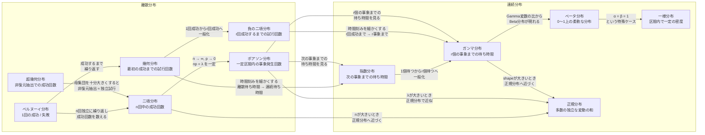

```mermaid
flowchart LR

    %% =========================
    %% 離散分布
    %% =========================
    subgraph Discrete["離散分布"]
        direction TB

        Bernoulli["ベルヌーイ分布<br/>1回の成功 / 失敗"]

        Binomial["二項分布<br/>n回中の成功回数"]

        Geometric["幾何分布<br/>最初の成功までの試行回数"]

        NegBinomial["負の二項分布<br/>r回成功するまでの試行回数"]

        Hypergeometric["超幾何分布<br/>非復元抽出での成功回数"]

        Poisson["ポアソン分布<br/>一定区間内の事象発生回数"]

        Bernoulli -->|"n回独立に繰り返し<br/>成功回数を数える"| Binomial

        Bernoulli -->|"成功するまで<br/>繰り返す"| Geometric

        Geometric -->|"1回成功からr回成功へ<br/>一般化"| NegBinomial

        Hypergeometric -->|"母集団を十分大きくすると<br/>非復元抽出 ≈ 独立試行"| Binomial

        Binomial -->|"n → ∞, p → 0<br/>np = λ を一定"| Poisson
    end


    %% =========================
    %% 連続分布
    %% =========================
    subgraph Continuous["連続分布"]
        direction TB

        Exponential["指数分布<br/>次の事象までの待ち時間"]

        Gamma["ガンマ分布<br/>r個の事象までの待ち時間"]

        Beta["ベータ分布<br/>0〜1上の柔軟な分布"]

        Uniform["一様分布<br/>区間内で一定の密度"]

        Normal["正規分布<br/>多数の独立な変動の和"]

        Exponential -->|"1個待つからr個待つへ<br/>一般化"| Gamma

        Gamma -->|"Gamma変数の比から<br/>Beta分布が現れる"| Beta

        Beta -->|"α = β = 1<br/>という特殊ケース"| Uniform
    end


    %% =========================
    %% 離散時間 → 連続時間
    %% =========================
    Geometric -->|"時間刻みを細かくする<br/>離散待ち時間 → 連続待ち時間"| Exponential

    NegBinomial -->|"時間刻みを細かくする<br/>r回成功まで → r事象まで"| Gamma


    %% =========================
    %% ポアソン過程
    %% =========================
    Poisson -->|"次の事象までの<br/>待ち時間を見る"| Exponential

    Poisson -->|"r個の事象までの<br/>待ち時間を見る"| Gamma


    %% =========================
    %% 正規分布への極限・近似
    %% =========================
    Binomial -->|"nが大きいとき<br/>正規分布へ近づく"| Normal

    Poisson -->|"λが大きいとき<br/>正規分布で近似"| Normal

    Gamma -->|"shapeが大きいとき<br/>正規分布へ近づく"| Normal
```

